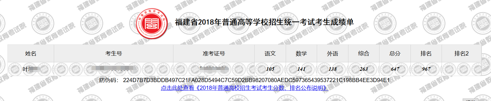
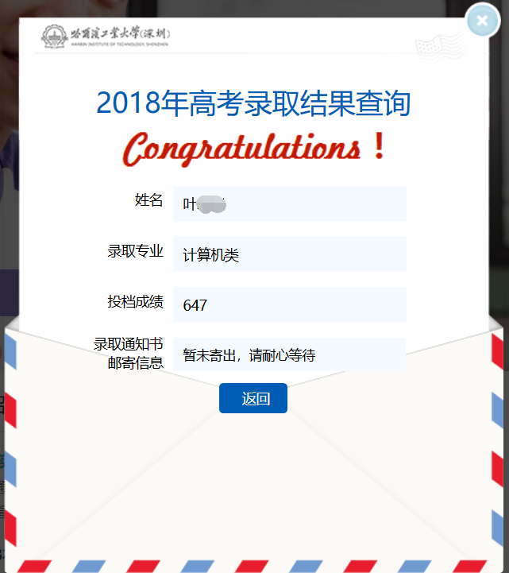
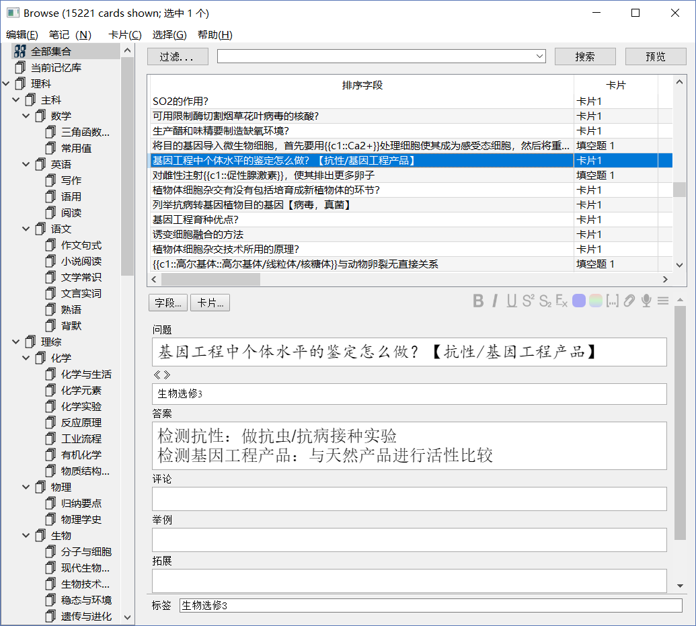

# Introduction

GitHub 项目仓库：[L-M-Sherlock/AnkigaokaoTutorial](https://github.com/L-M-Sherlock/AnkigaokaoTutorial)

高中生都能懂的 Anki 使用手册！

我是本书作者[叶峻峣](https://www.zhihu.com/people/L.M.Sherlock)，福建省 2018 届考生，高考分数 **647**，全省理科第 **967** 名，哈尔滨工业大学（深圳）的计算机专业在读；

运用 Anki 学习高中知识；

制作 **15221** 张卡片备战高考。

我相信只要边看本书边开始实践，

你也可以在学习上找到属于自己的道路！

欢迎加入 [Anki 圈子](https://www.zhihu.com/club/1182973609588469760)交流、打卡

  
本作品采用[知识共享署名-相同方式共享 4.0 国际许可协议](http://creativecommons.org/licenses/by-sa/4.0/)进行许可。

