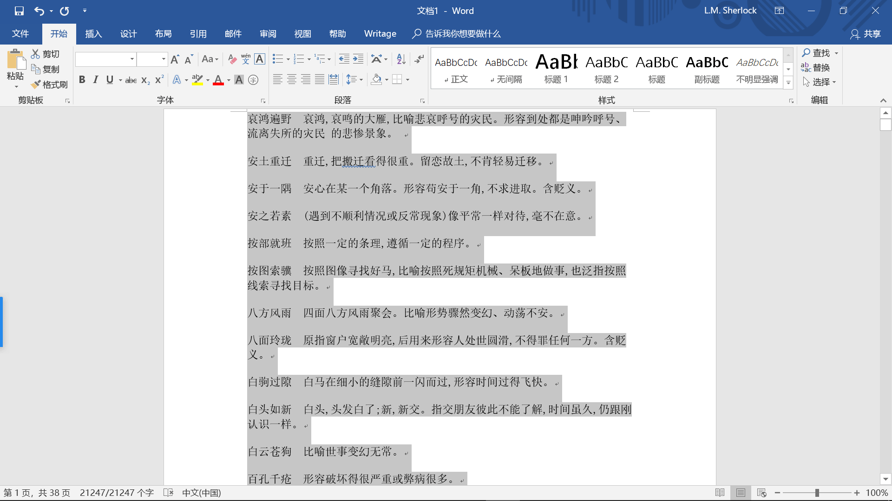
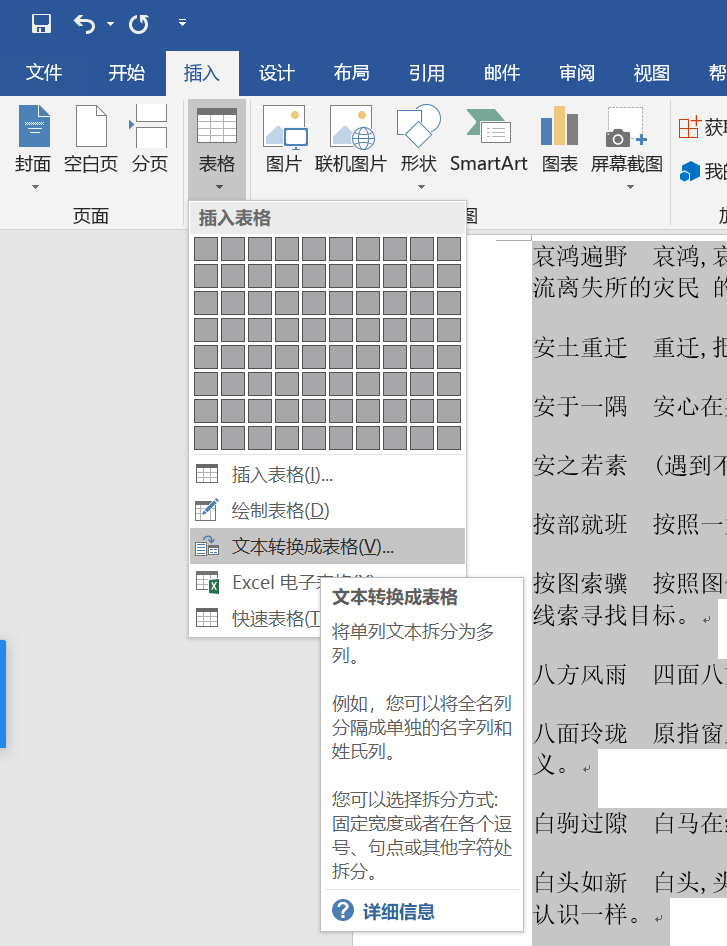
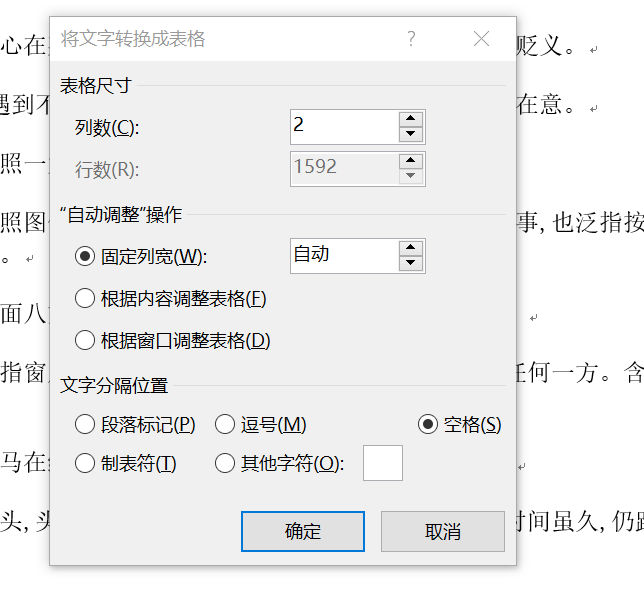
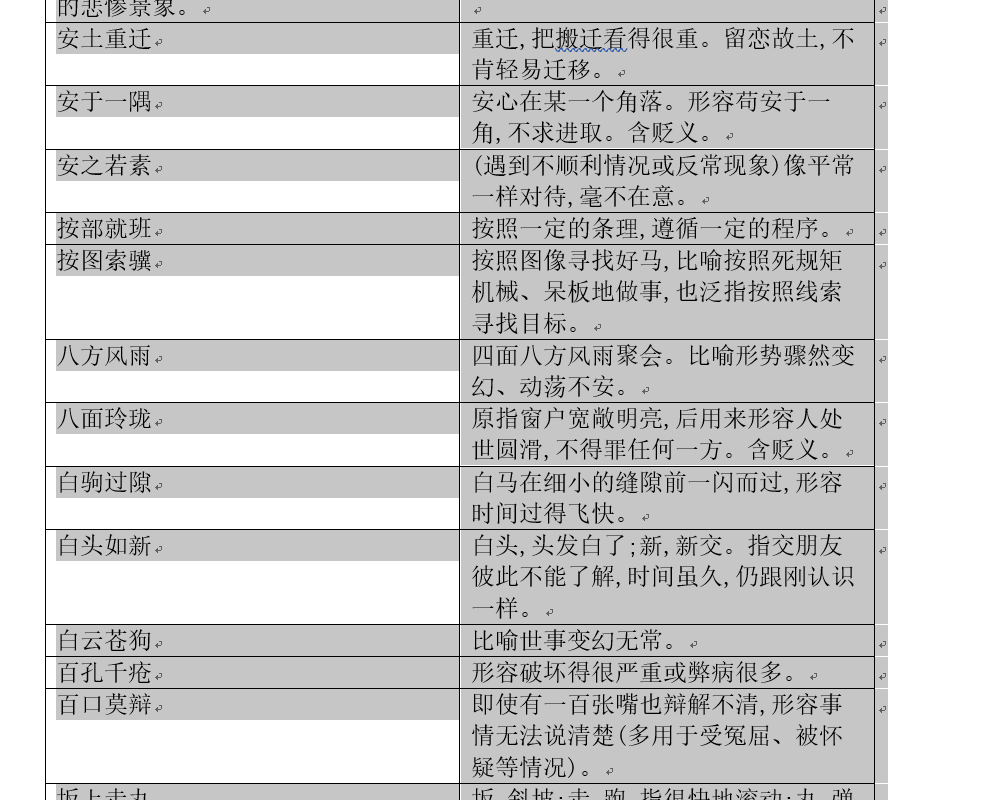
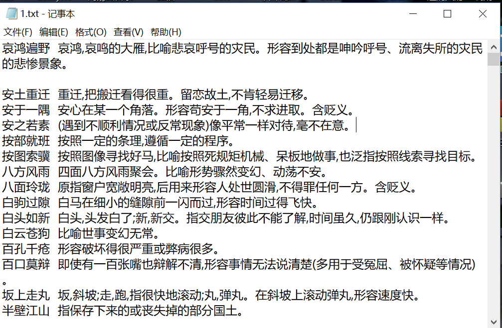
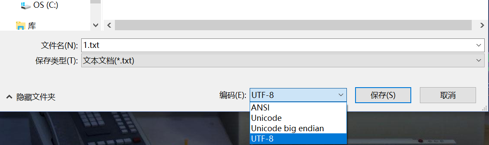
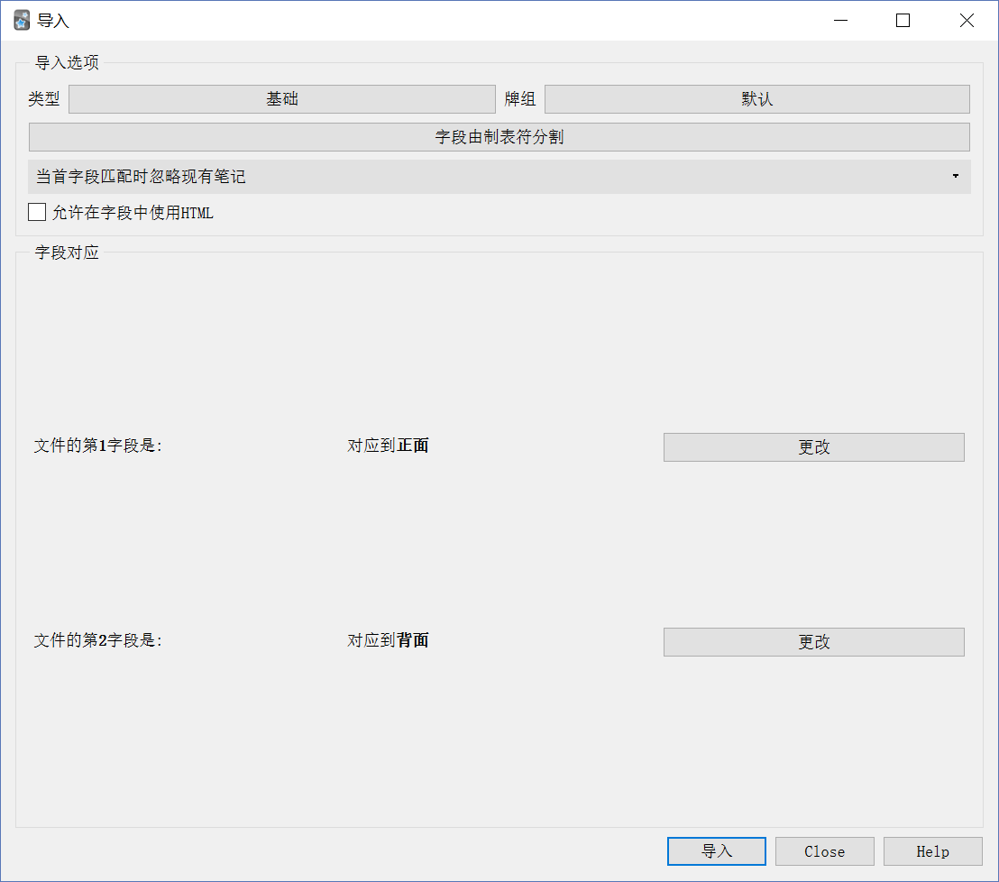
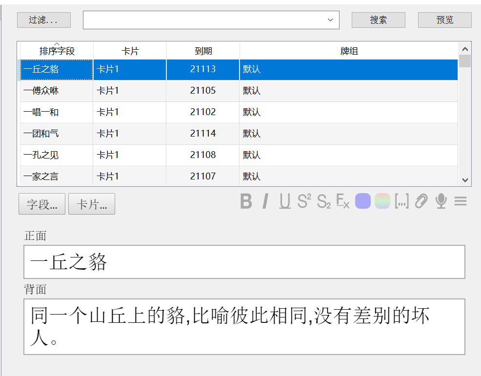

# 4.1 电子材料批量制卡
> 文档转表格批量制卡

材料取自
>[info] 知乎文章：正确使用词语\(包括熟语\)
> https://zhuanlan.zhihu.com/p/26345610
> 注意，上述链接指向本书外的网站

先把材料都复制到 Word 文档中

全选，点击插入-文本转换成表格

列数填入每行分割出来的字段数
文字分隔位置依具体文本而定
本材料的成语部分和解释部分由空格分隔
所以我们用空格

分割好了！

把表格复制到记事本里

记得另存为时，选择 UTF-8 编码

然后就可以在 Anki 中直接导入 .txt 后缀的文件了

:-: 效果图

是不是很高效呢？
