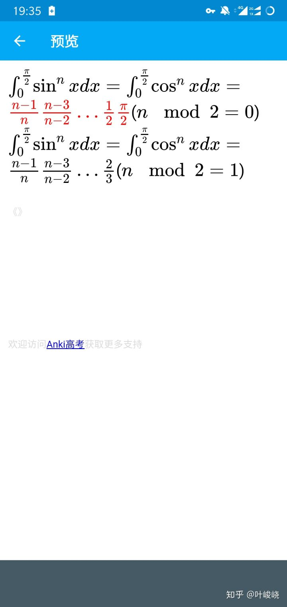
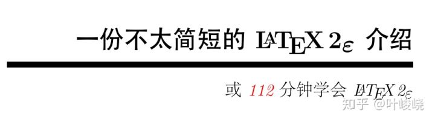
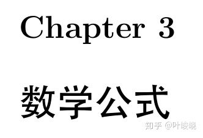
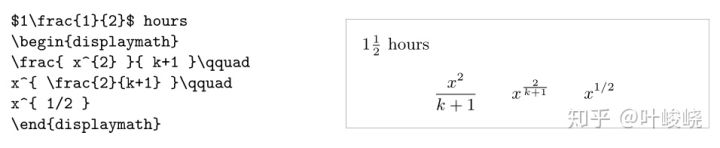
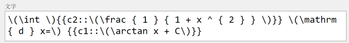
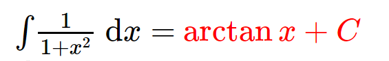
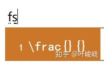

> 输入数学公式、化学方程式等内容

先看看效果

1. 找一份 latex 教程，比如：

> [warning] 点击下面的链接即可下载教程
> **注意**，这会导致转跳到本书之外的网站
> 百度网盘
> [112分钟学会 LATEX](https://pan.baidu.com/s/10o0JWR-7_QtuqFFRaLyXtw)

2. 直接到数学公式这一章：

3. 开始学（复）习（制）：

比如：

效果：

注意！一定要用 \\( \\) 把 latex 公式套住，不要用 $$ 或 [$][/$]。

4. 把常用的公式加入输入法快捷短语（我现在改用 win10 自带的微软拼音，还不错）

5. 随心所欲地输入任何你想输入的公式吧！

注意，如果出现公式无法渲染，请安装较新的 Anki 版本。

这里推荐通过我的百度网盘下载

>[warning] 点击下面的链接即可
>**注意**，这会导致转跳到本书之外的网站
>百度网盘
>https://pan.baidu.com/s/16JFHGO9Yk1hlUD1d84iCGA

