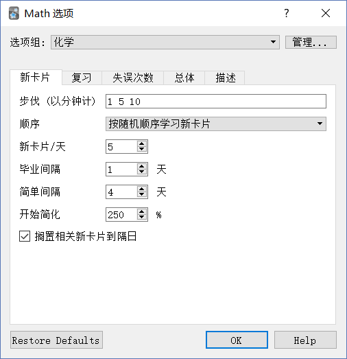

# 4.5 算法参数

> 算法和参数的简单介绍

先拿两个图来展示一下

:-: 

:-: 

步伐：第一个数字是学习新卡片选择【重来】的间隔，1 表示重来的间隔是 1 分钟，即一分钟后会重新出现。后面的数字是学习新卡片时选择【一般】的间隔， 5 10 表示第一次间隔 5 分钟，第二次间隔 10 分钟；

毕业间隔：学习新卡片后连续选择【一般】的间隔；

简单间隔：学习新卡片后选择【简单】的间隔；

开始简化：其实英文是 starting ease ，即**初始简易度**，这个决定了每次间隔之间的**倍数**；

简单奖励：与选择【简单】的间隔有关；

间隔修饰符：与所有复习间隔有关。 失误次数-步伐：复习卡片选择【重来】的间隔；

新间隔：重来卡片连续选择一般/简单后，下次复习的【间隔】= 之前复习的间隔 \* 【新间隔】，默认为 0；

最小间隔：因为新间隔算出来可能很小，如果小于最小间隔，就用最小间隔来替代下次复习的【间隔】；

难点阈值：设置难点阈值，即累计失误次数；

记忆难点动作：如果一张卡片的失误次数超过难点阈值，就会【暂停卡片】或者【仅标记】。

以上是所有与算法相关的术语，接下来就简单的说说算法吧！

首先，每张卡片的复习间隔都与卡片本身的**简易度**、**上一次的间隔**和此次的**选项**有关

如果你按下了……

【重来】

卡片进入重新学习队列，简易度减少 20 个百分点（比如，原来的简易度是 250%，现在变成 230%）

【困难】

卡片的简易度减少 15 个百分点，当前的间隔乘以 1.2。

【一般】

当前间隔乘以当前简易度，简易度不变。（比如上一次的间隔是 10 天，简易度是 250%，那么下一次的间隔就是 10\*250%=25（天））。

【容易】

当前间隔乘以当前简易度再乘以简单奖励，简易度增加 15 个百分点。（比如上一次的间隔是 10 天，简易度是 250%，那么下一次的间隔就是10\*250%\*130%=32.5≈33（天），简易度为 250%+15%=265%）。

所以呢？间隔修饰符有什么用呢？ 由于间隔修饰符初始值为 100%，所以任何间隔都乘以 100%，即不变。如果你想增大任何间隔，就把它调整到大于 100% 吧。

PS：简易度最低为130%，算法默认重来8次就会暂停这张卡片，免得气到你，233。

PPS：研究算法源码后我还发现，算法调用了随机算法，所以同样进度的卡片在同样的选项下可能会有不同的间隔，可以错开复习时机。

关于修改参数的模拟结果，可以参考这一篇[文章](https://zhuanlan.zhihu.com/p/78398403)。

