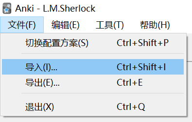
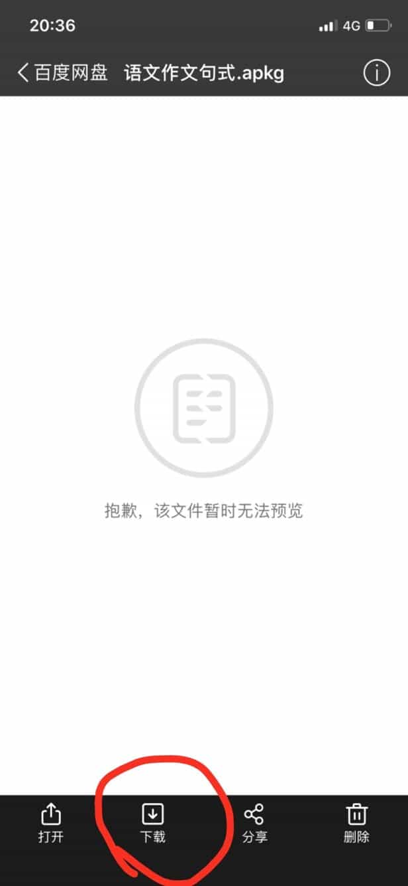
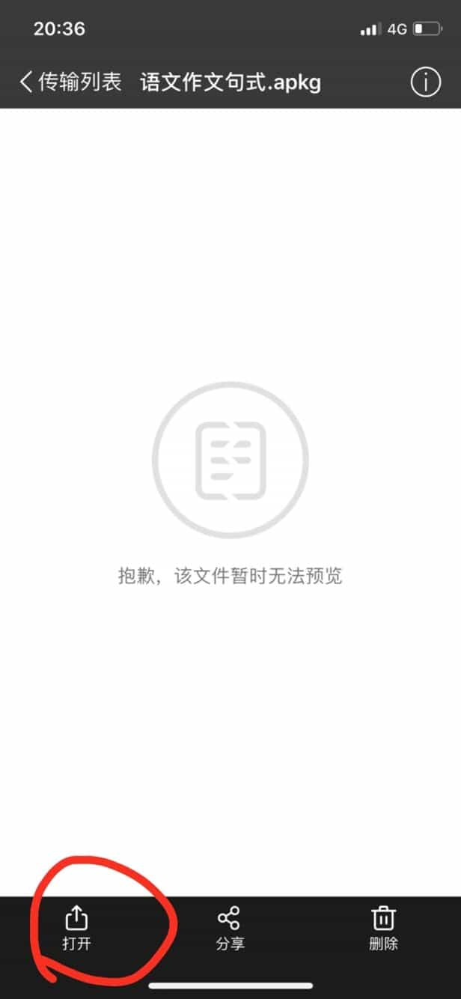
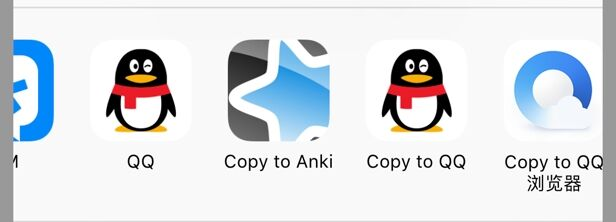

> .apkg 文件（「牌组/记忆库」）在各系统的打开方法

[TOC=2,4]

「牌组/记忆库」即「卡片」的集合，用于分类储存「卡片」。
试用材料请用百度云下载

>[warning] 点击下面的链接即可
> **注意**，这会导致转跳到本书之外的网站
> https://pan.baidu.com/s/1dA5jpF4PoyIlnAG2Z3m0PQ

## 3.1.1 Windows/Mac

:-: 

如图所示，只要你安装好 Anki，.apkg 文件就会自动关联好，只要双击打开，就可以导入了。

:-: 

如果不行的话，就像上图所示，手动导入。

## 3.1.2 Android

这里文字说明有点困难，如果你安装了我网盘内的 Ankidroid，可以尝试直接打开 .apkg 牌组文件。如果打开失败，请看下面的视频教程：

[将从QQ群下载的牌组文件导入到 AnkiDroid](https://www.bilibili.com/video/av41518619/?p=8)

[找到百度云下载的牌组文件](https://www.bilibili.com/video/av41518619/?p=9)

## 3.1.3 iOS

打开百度云

:-: 下载

:-: 打开

:-: 如果有 Copy  to Anki 就直接点

:-: 如果没有，可能藏在 More 里面

