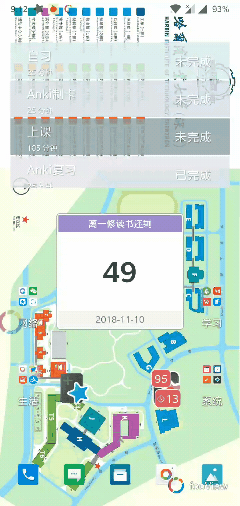
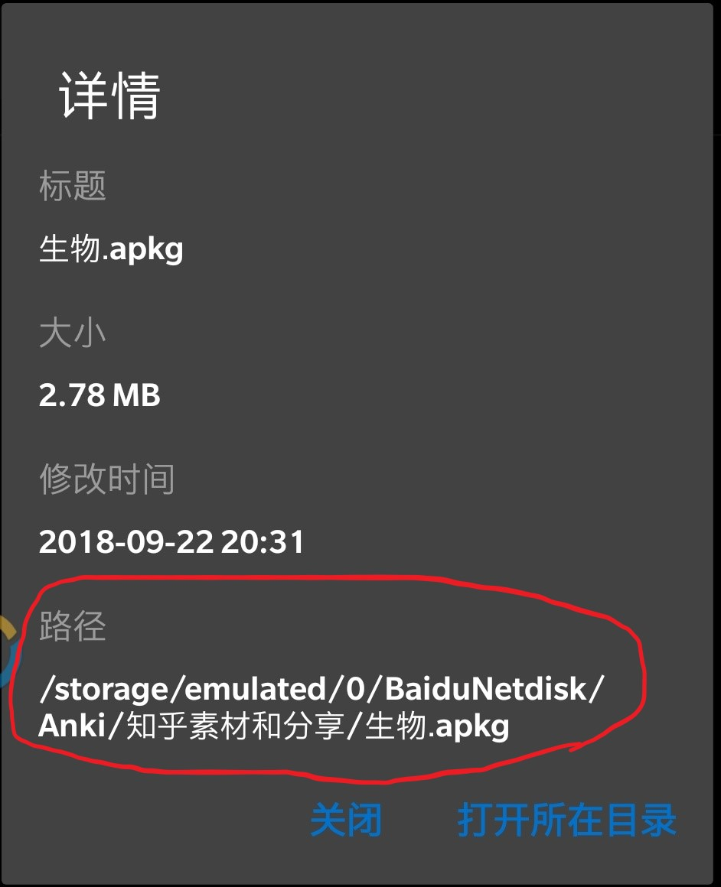
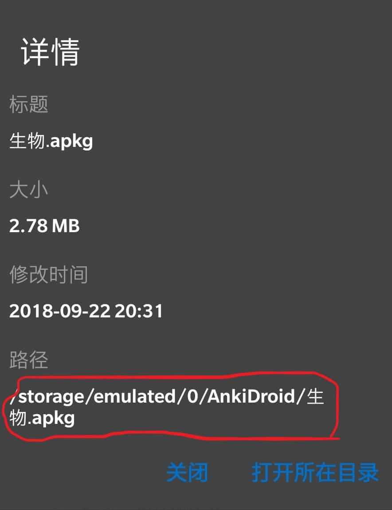

# 3.1 导入卡片
> .apkg文件在各系统的打开方法

试用材料[百度云下载](https://pan.baidu.com/s/1dA5jpF4PoyIlnAG2Z3m0PQ)

或者在下面下载

## 3.1.1 Windows/Mac

如图所示，只要你安装好 Anki ，.apkg文件就会自动关联好，只要双击打开，就可以导入了。

如果不行的话，就像上图所示，手动导入。

## 3.1.2 Android

具体过程如下图

当然，上图是在你已经把牌组移动到指定位置了。

一般来说，百度云下载的地址如下图

  
你只需要把牌组移动到下图的地址即可

## 3.1.3 iOS

打开百度云

下载

  
打开

如果有 Copy  to Anki 就直接点

如果没有，可能藏在 More 里面

