> 如何简单地制卡

[TOC=2,4]

## 3.4.1 Windows/Mac

:-: 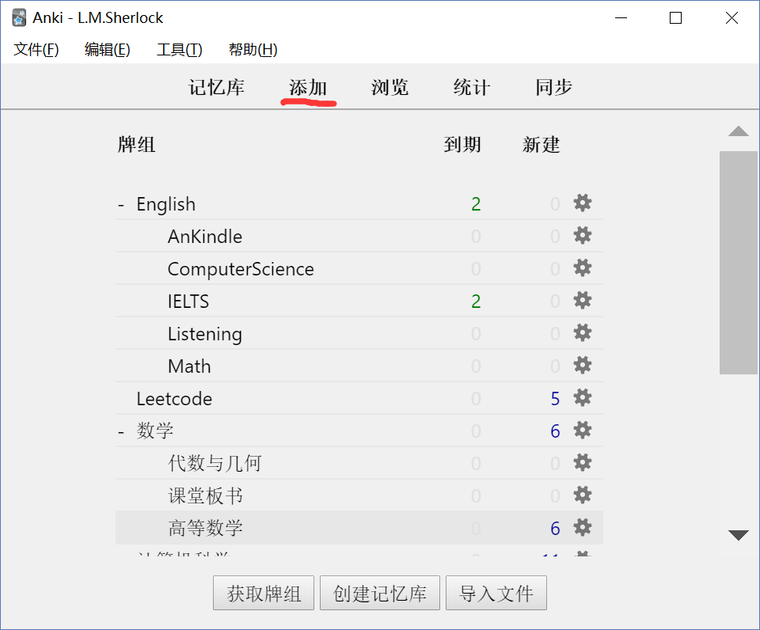点击添加

:-: 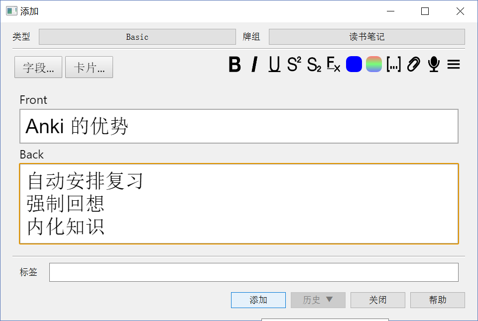

类型：「卡片」的模板，可以是问答、填空、只读等；

「牌组/记忆库」：「卡片」的归属，决定了该「卡片」制作后会存在哪个「牌组/记忆库」等待学习；

Front：「卡片」的正面；

Back：「卡片」的背面。

:-: 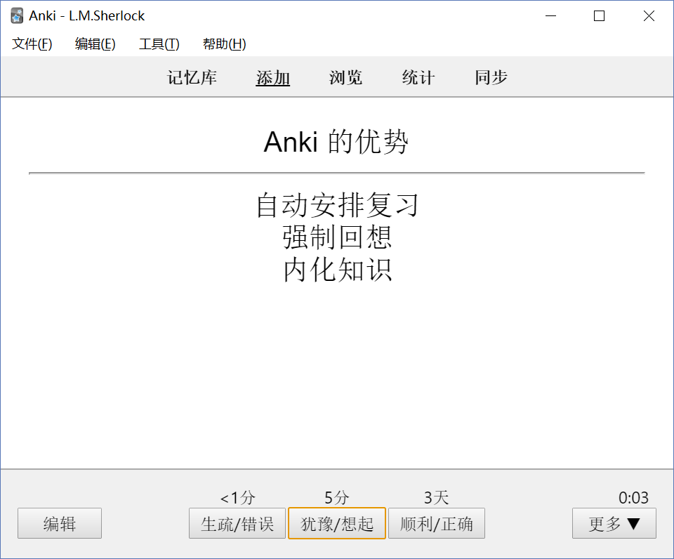效果图

:-: 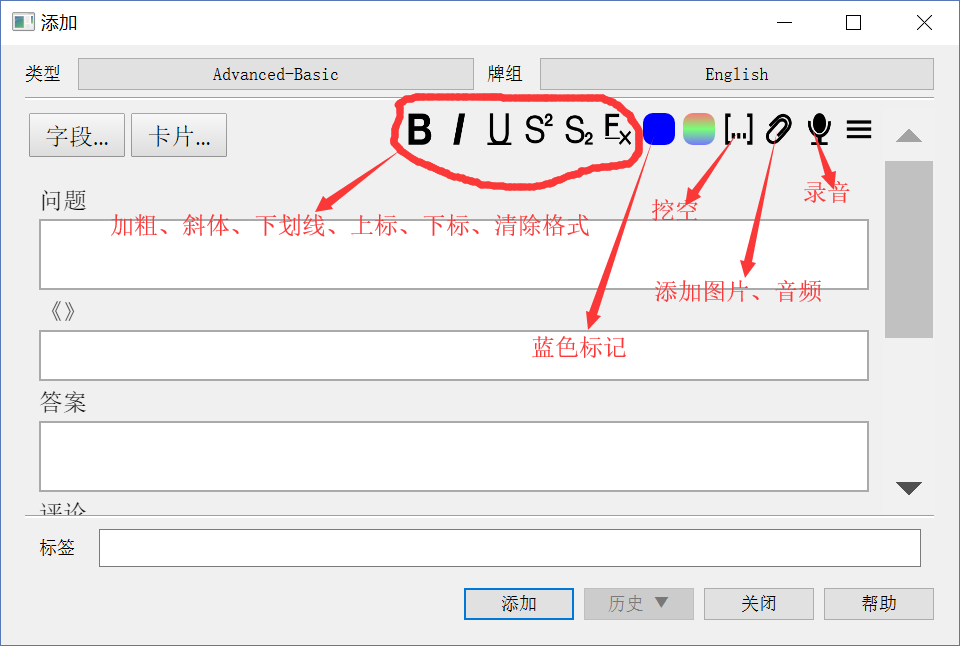一些详细介绍

## 3.4.2 Android

:-: 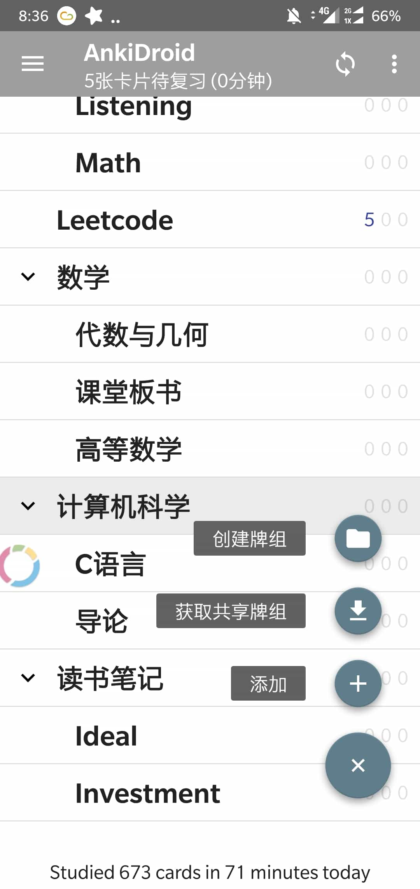点击添加

:-: 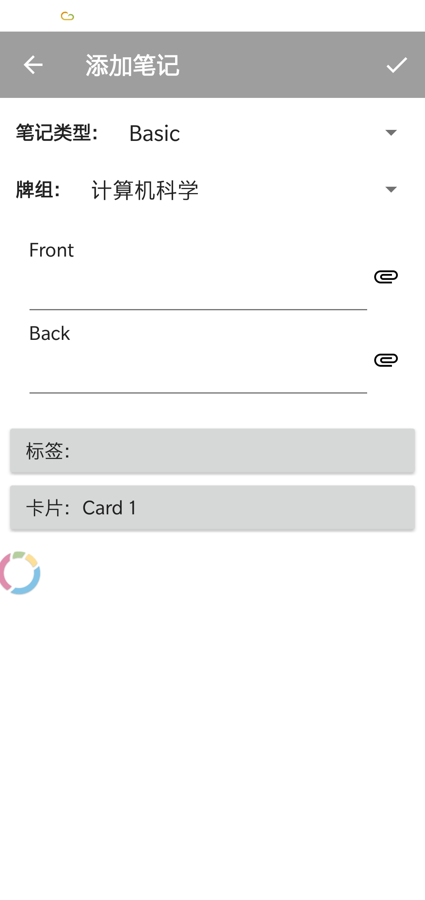输入完正面和反面，点击“√”即可添加

:-: 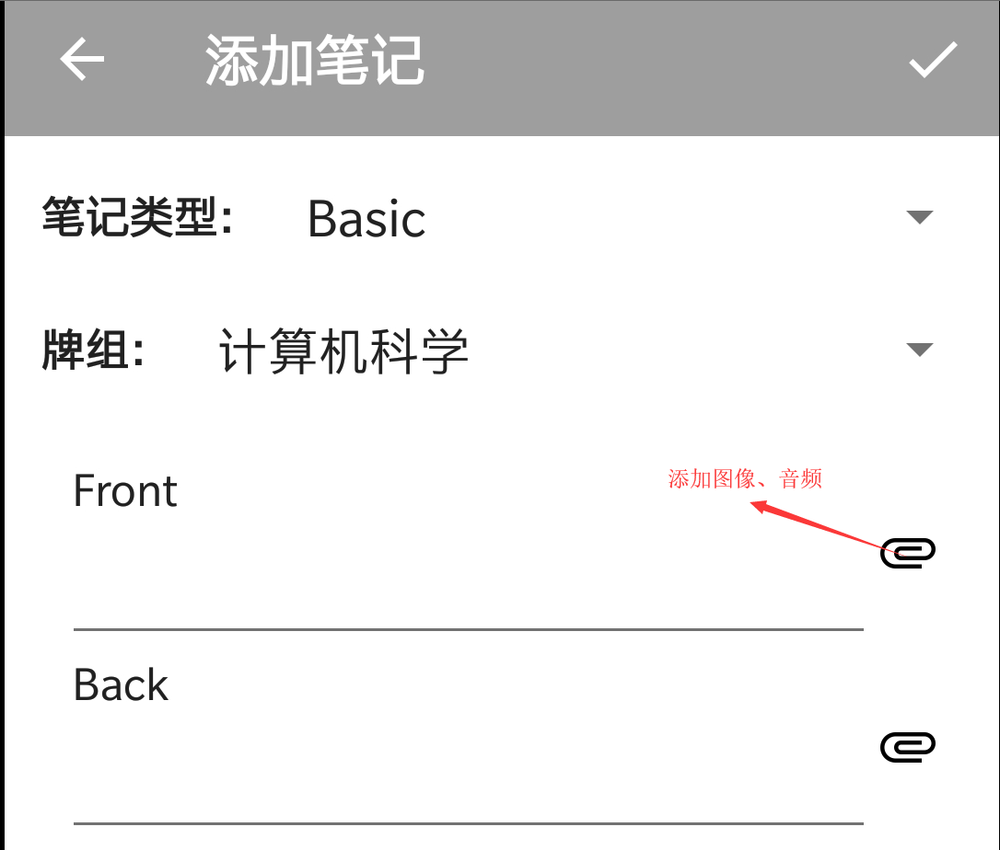需要添加图片或者音频，点击“回形针”按钮
（图上的字有点小，请认真看）
  
安卓端常用代码：

&lt;font color="\#0000ff"&gt;变蓝&lt;/font&gt;

{{c1::挖空}}、{{c2::挖空}}

&lt;b&gt;加粗&lt;/b&gt;

&lt;sub&gt;下角标&lt;/sub&gt;

&lt;sup&gt;上角标&lt;/sup&gt;

##  3.4.3 iOS

:-: 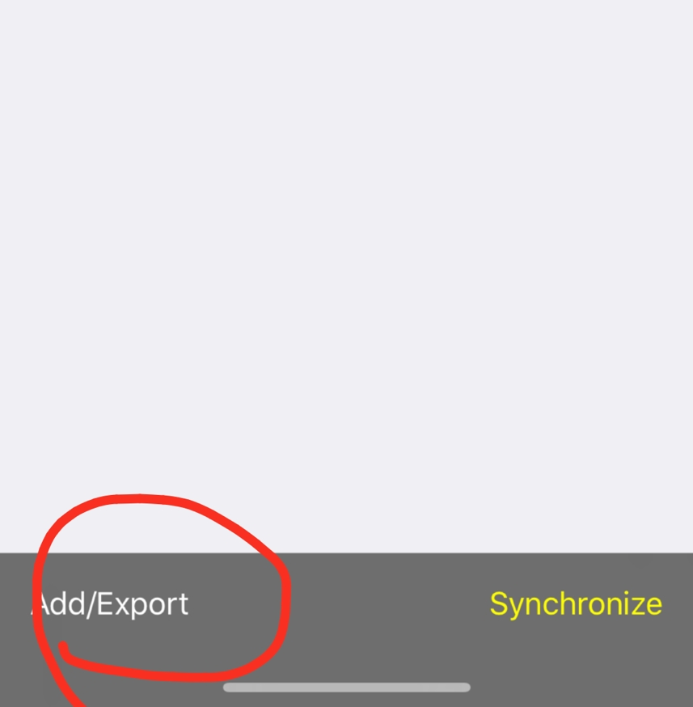点击add/Export

:-: 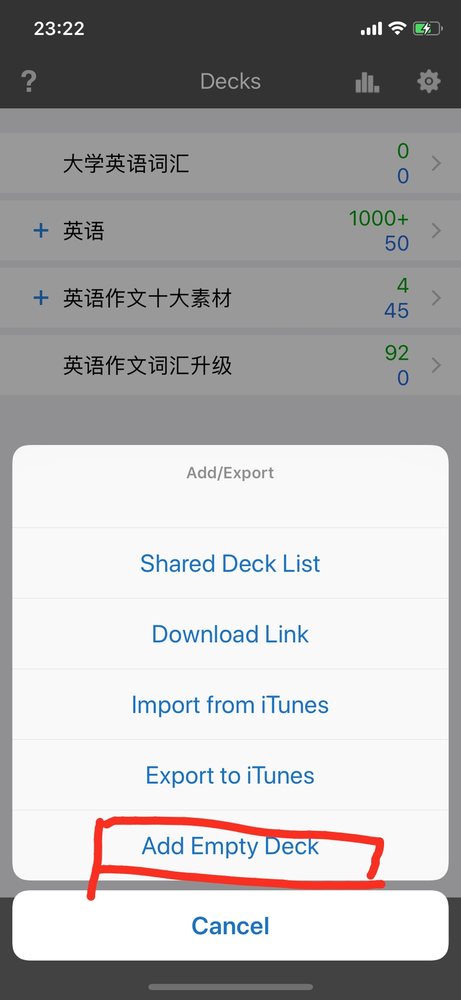
点击 Add Empty Deck，创建新「牌组/记忆库」
:-: 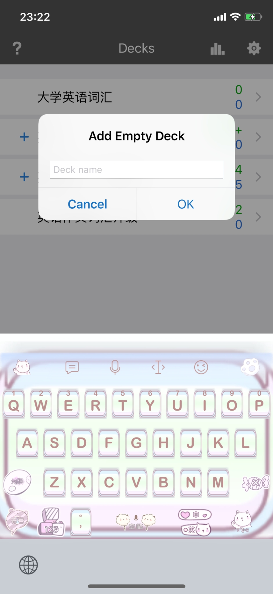命名「牌组/记忆库」

:-: 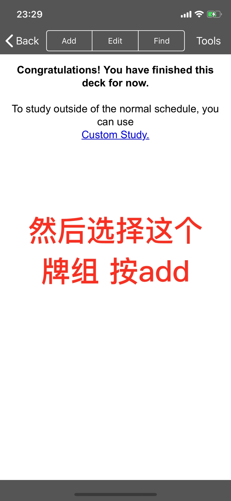点击 Add

:-: 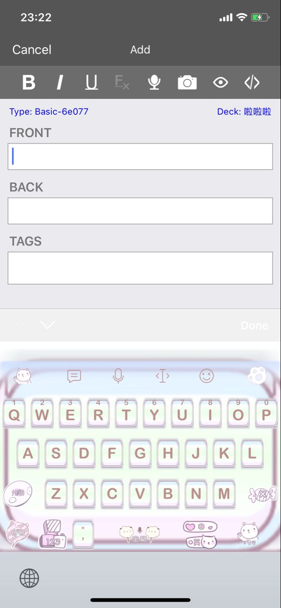

剩下的就和桌面端和安卓端类似了。

