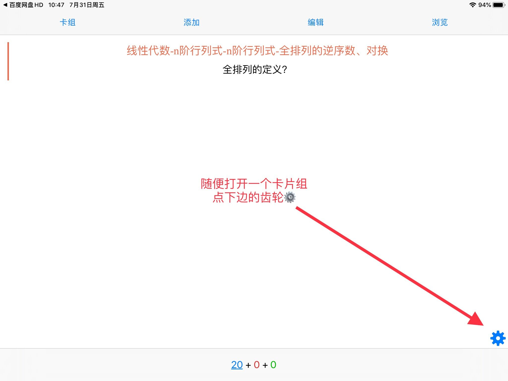
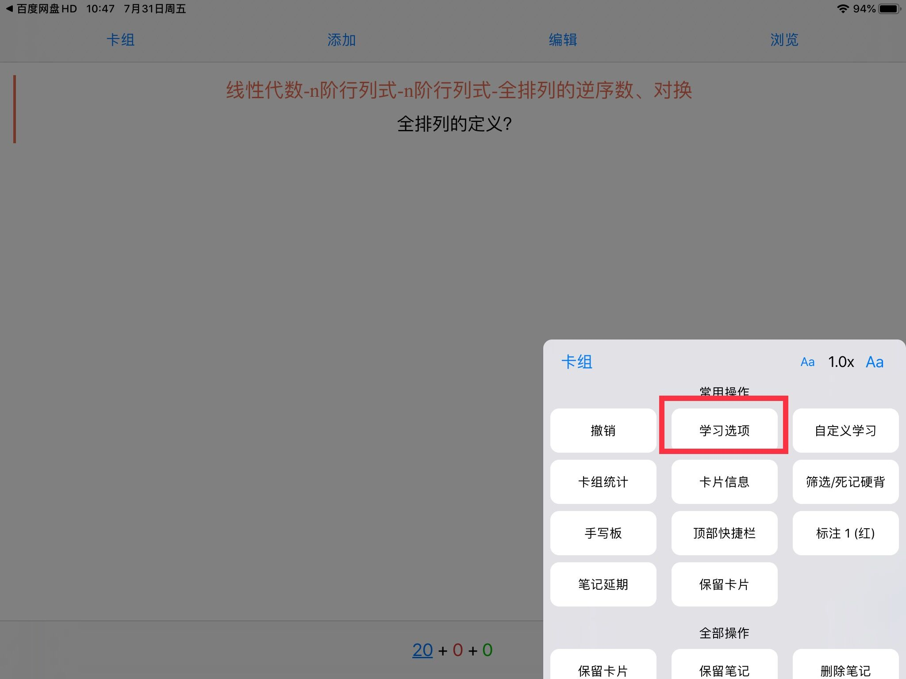
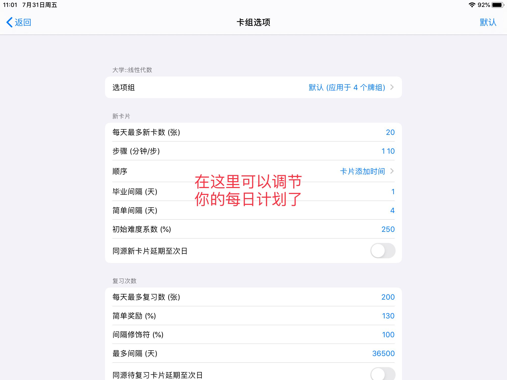
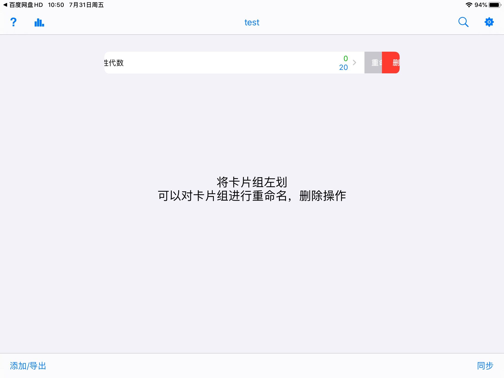
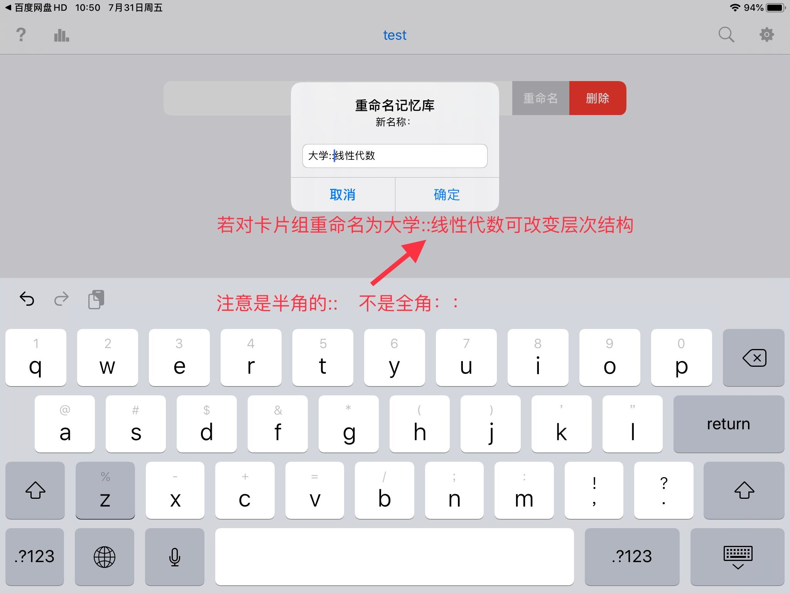
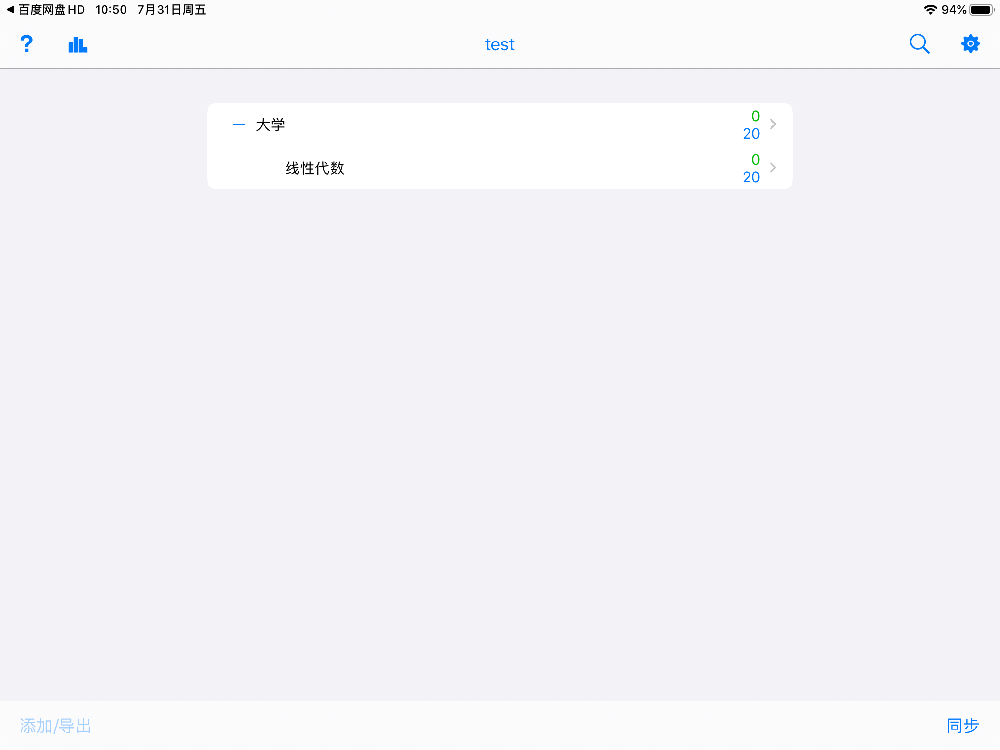

# 3.2 制定计划

> 关于「选项组/学习计划」的简单介绍

\[TOC=2,3\]

本文暂不做介绍的内容都会在下面这篇文章介绍。

> \[success\] [4.5 算法参数修改](https://github.com/L-M-Sherlock/AnkigaokaoTutorial/tree/b82008e9b3758f399a722fb33777cba00dce5458/advanced-operation/modify-parameter.md)

## 3.2.1 Windows/Mac

### 3.2.1.1 找到「选项组/学习计划」

点击「牌组/记忆库」旁边的小齿轮

:-: 

打开后是这样的，如下图

:-: 

### 3.2.1.1 创建「选项组/学习计划」

点击管理 &gt;&gt; 添加，即可创建一个「选项组/学习计划」如下图

:-: 

### 3.2.1.2 每日新学习设置

然后，新「卡片」就是每天学习的「卡片」数量。（具体设置为多少看下一篇）

搁置相关新「卡片」是为了防止相同内容（更准确的说是正面反面互换）的「卡片」出现在同一天。建议选上。

本页剩下的部分暂不做介绍。

### 3.2.1.3 每日复习设置

:-: 

建议把最大复习数量调的尽可能高，让需要复习的「卡片」在当天解决。

剩下的暂不做介绍。

### 3.2.1.4 回答错误设置

:-: 

记忆难点动作——某张「卡片」你累计回答错误8次就会执行动作。建议暂停这张「卡片」，避免花费太多时间死磕。

剩下的暂不做介绍。

### 3.2.1.5 规划「牌组/记忆库」层级结构

怎样制作像下图一样的层级结构，让「牌组/记忆库」更有条理？

:-: 

其实很简单，只要拖动子「牌组/记忆库」到父「牌组/记忆库」上就可以了。

> \[info\]  父「牌组/记忆库」的学习限制优先度高于子「牌组/记忆库」的学习限制。 例如： 小明创建了理科这个**父**「牌组/记忆库」，其**子**「牌组/记忆库」有物理和数学
>
> 理科的新学习限制为 50 张，而物理和数学各自的限制也是 50 张
>
> 若小明学了 50 张物理牌组的「卡片」，那么物理牌组和理科「牌组/记忆库」同时达到限制，所以数学牌组的「卡片」就无法用于新学习

## 3.2.2 Android

### 3.2.2.1 设置「选项组/学习计划」

长按「牌组/记忆库」&gt;&gt; 点击牌组选项 你就会看到：「选项组」、「组管理」、「新卡片」、「复习」等选项。 「选项组」用来选择学习计划（初始只有 default 这一种） 「组管理」用来重命名学习计划、新建学习计划 「新卡片」用来设置每天学习的数量 「复习」用来设置每天复习的数量

:-: 

视频教程：[为单个牌组设置独立的选项组和设置新卡片数量](https://www.bilibili.com/video/av41518619?p=10)

### 3.2.2.2 设置「牌组/记忆库」层级结构

长按「牌组/记忆库」&gt;&gt; 点击重命名 如果你想把「数学」这个牌组放入「理科」的目录之下，就把「数学」牌组命名为 理科::数学

:-: 

视频教程：[同时创建父牌组和子牌组](https://www.bilibili.com/video/av41518619?p=7)

## 3.2.3 iOS

### 3.2.3.1 设置「选项组/学习计划」

:-: 

:-: 

:-: 

### 3.2.3.2 设置「牌组/记忆库」层级结构

左划牌组重命名哦，其他的都和安卓差不多，看下面的图就好了~

:-: 

:-: 

:-: 

