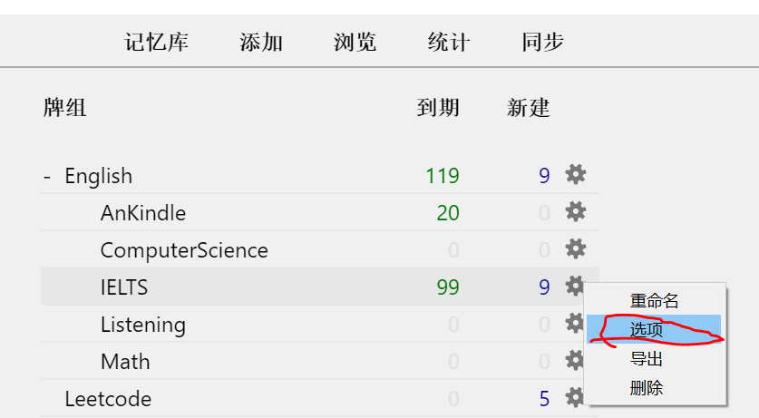
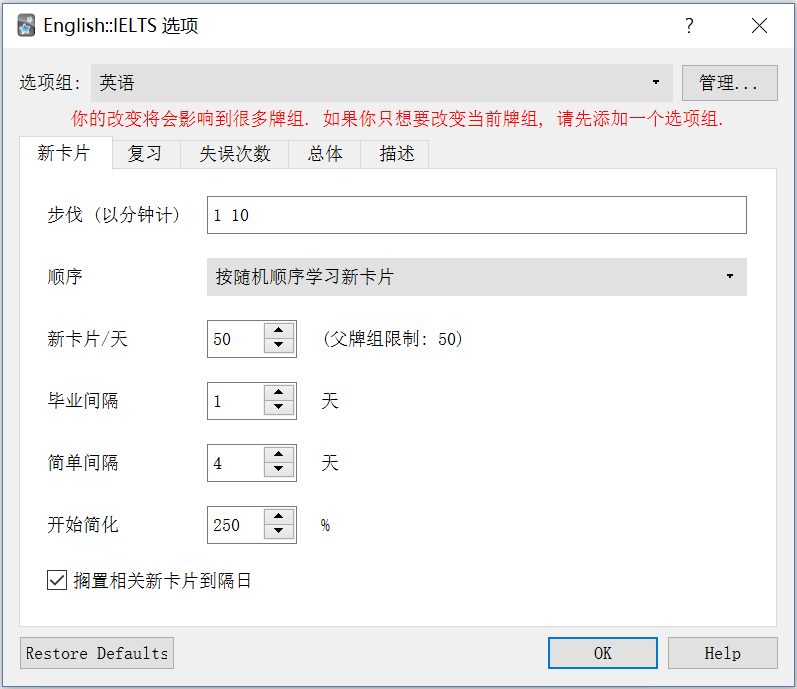
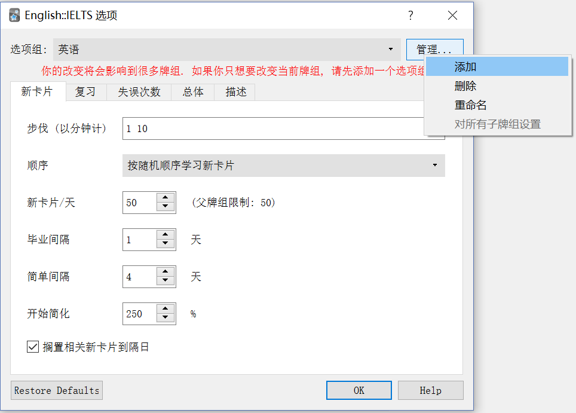
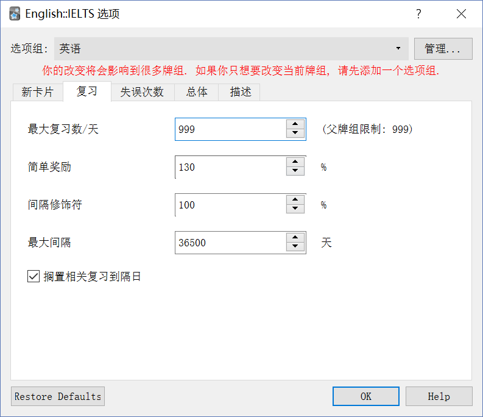
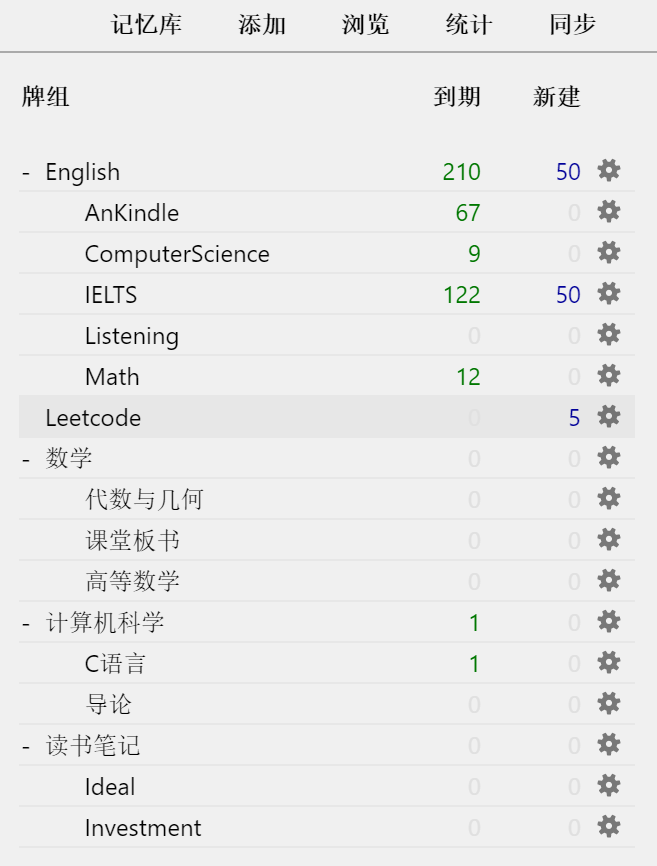
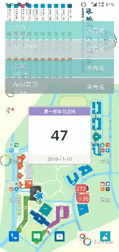
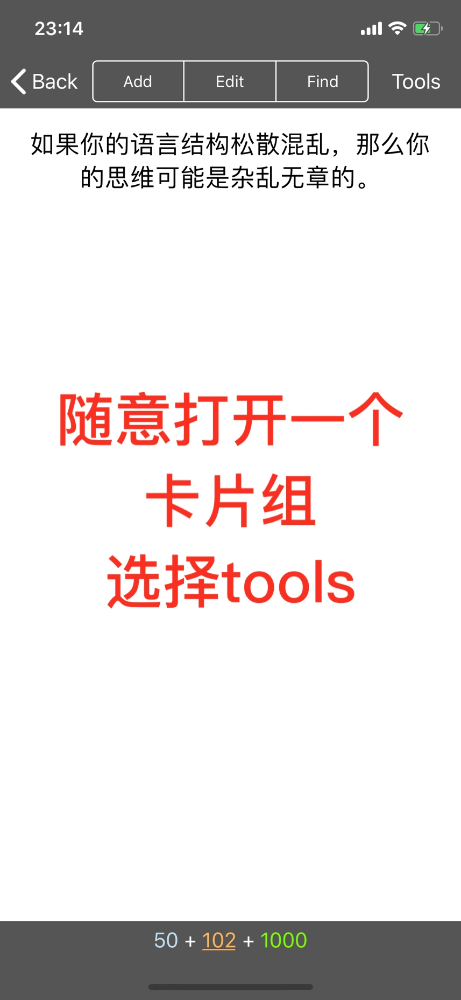
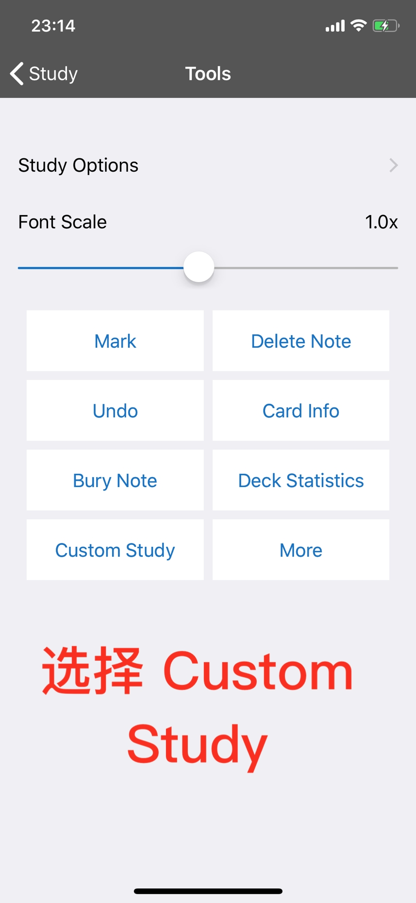
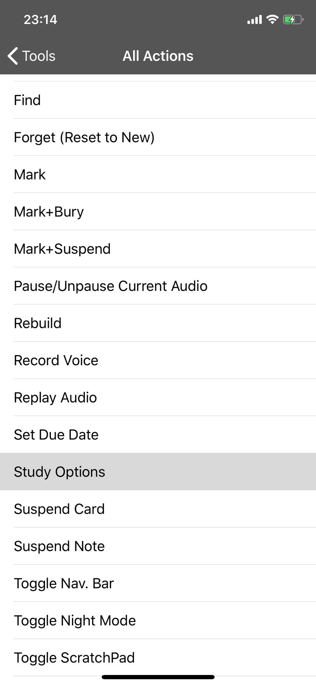
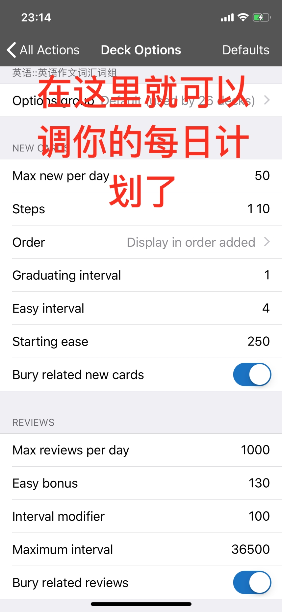

> 关于选项组（学习计划）的简单介绍
[TOC=2,3]
本文暂不做介绍的内容都会在下面这篇文章介绍。

>[success] [4.5 算法参数修改](../advanced-operation/modify-parameter.md)

## 3.2.1 Windows/Mac

### 3.2.1.1 找到选项组（学习计划）

点击牌组旁边的小齿轮

:-: 
  
打开后是这样的，如下图

:-: 

### 3.2.1.1 创建选项组（学习计划）

点击管理——添加，即可创建一个选项组（学习计划）如下图  

:-: 

### 3.2.1.2 每日新学习设置 

然后，新卡片就是每天学习的卡片数量。（具体设置为多少看下一篇）

搁置相关新卡片是为了防止相同内容（更准确的说是正面反面互换）的卡片出现在同一天。建议选上。

本页剩下的部分暂不做介绍。

### 3.2.1.3 每日复习设置

:-: 

建议把最大复习数量调的尽可能高，让该复习的卡片在当天解决。

剩下的暂不做介绍。

### 3.2.1.4 回答错误设置

:-: 

记忆难点动作——某张卡片你累计回答错误8次就会执行动作。建议暂停这张卡片，避免花费太多时间死磕。

剩下的暂不做介绍。

### 3.2.1.5 规划牌组层级结构

怎样制作像下图一样的层级结构，让牌组更有条理？

:-: 

其实很简单，只要拖动子牌组到父牌组上就可以了。

>[info] 
> 父牌组的学习限制优先度高于子牌组的学习限制。
>  
> 例如：
> 小明创建了理科这个父牌组，其子牌组有物理和数学
> 
> 理科的新学习限制为 50 张，而物理和数学各自的限制也是 50 张
> 
> 若小明学了 50 张物理牌组的卡片，那么物理牌组和理科牌组同时达到限制，所以数学牌组的卡片就无法用于新学习

##  3.2.2 Android

### 3.2.2.1 设置选项组（学习计划）

:-: 

### 3.2.2.2 设置牌组层级结构

:-: 

## 3.2.3 iOS

### 3.2.3.1 设置选项组（学习计划）

:-: 

:-: 

:-: 

:-: 

:-: 

:-: 

### 3.2.3.2 设置牌组层级结构

:-: 

:-: 

