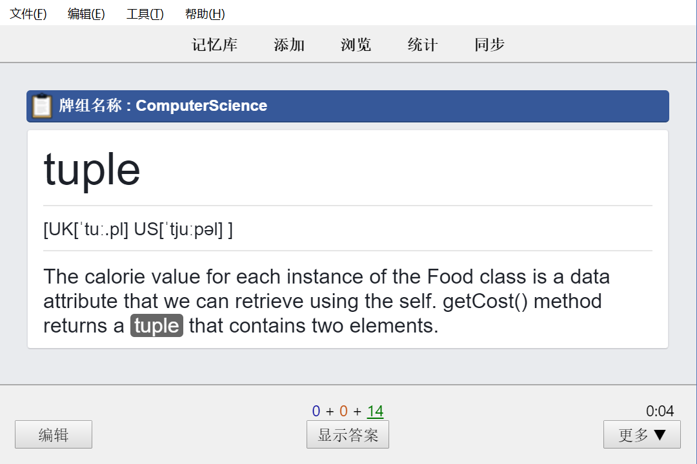
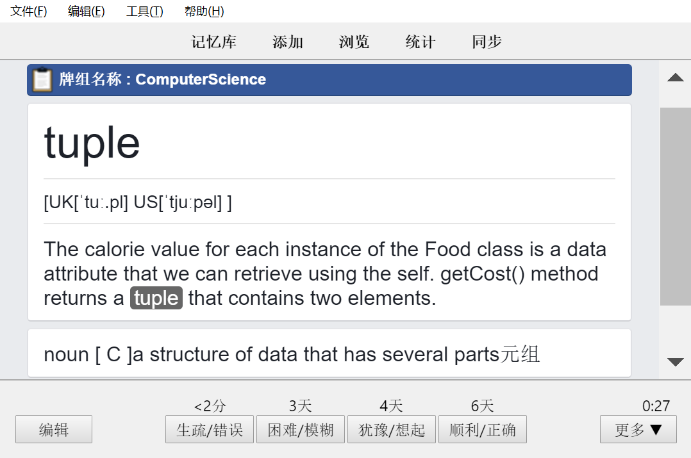

> 学习和复习卡片的种种操作
[TOC=2,4]
### 3.3.1 开始学习

点开一个牌组，显示如下

调动记忆，回想答案。

  
对照答案并根据回忆顺利程度选择间隔，如果不确定看参考下面的标准：

### 3.3.2 间隔选择标准

自己的复述与卡片上的关键点相比，存在遗漏或表述不规范，甚至有误，请 again（生疏）

正确踩点，但是所用时常超过平均值的一半，或者大考即将来临，选择 hard（困难）

正常的反应速度，准确的表述，选 normal（犹豫）

太简单、太熟悉，简直就是条件反射，同时卡片的信息量也很小，直接 easy（顺利）

### 3.3.3 一张卡片花多少时间回忆算正常呢？

依照科目的不同、材料的不同、卡片的设计不同，回忆所需的时间也不同。

英语 80 - 120 张/10 分钟，语文 50 - 80 张/10 分钟，生物 40 - 50 张/10 分钟。

其余科目记忆的材料类型较为复杂，比如化学中的化学与生活，速度与语文相似，但是化学答题规范的回忆会比生物还稍慢。

新学的一张卡片花费的时间大约是复习一张卡片花费的时间的 2 ～ 3 倍。

### 3.3.4 每天新学多少张卡片合适？

英语 30 - 50 张，语文 20 - 30 张，生物 10 - 15 张。

其实这个没必要限定，能在高考前一两个月全部过完即可，不要急功近利。

因为你每天新学 10 张卡片，一周后你的复习量是 20 左右，一个月后是 50 左右，请量力而为。

我高三下的复习量是 450 +，加上新学的，每天大概花一个小时用 Anki 。

### 3.3.5 什么时间段用 Anki 比较好？

因人而异，我早上刚起床时效率最高，一张卡片 6 秒内复述都做得到。

建议量最多的卡片在刚起床时学习。而早上没背完的卡片，可以排队背、等车背，总之任何碎片时间都可以用 Anki。

晚上睡觉前背诵也可以，但是一定不要打扰作息时间。

因此，我建议先复习再学习。如果今天时间紧，就只要复习完到期卡片即可。

