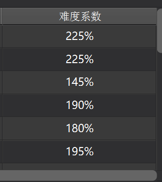
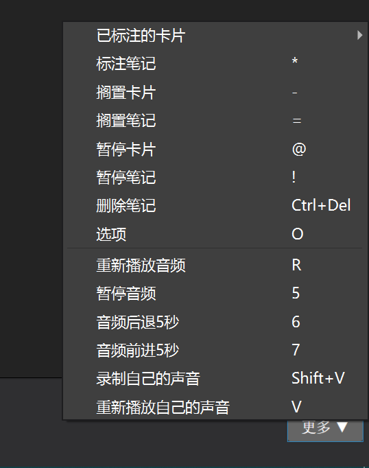
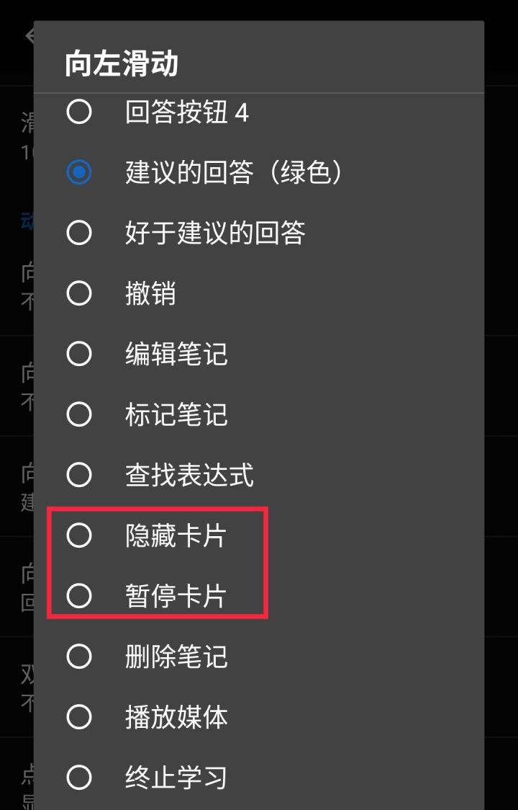
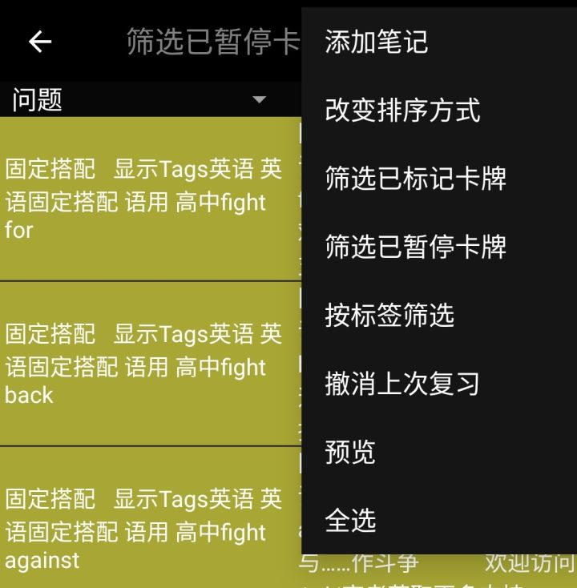
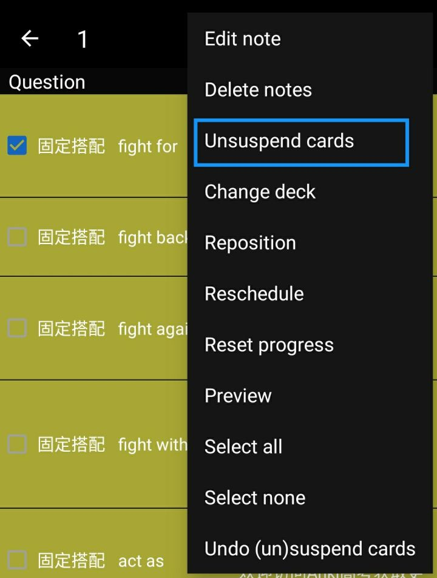

# 3.6 使用他人制作的牌组

> 别乱背别人的牌组

\[TOC=2,4\]

大多数 Anki 入门者只会基础操作（添加牌组、卡片，设置计划，学习卡片等等），而没有认识到 Anki 的原理。遇到别人制作的牌组，只会定好学习计划然后一头扎进去猛背。最后**背得很痛苦**，也**没学会**多少知识。

接下来我会从这个现象出发，给出我自己的理解，并提供我的解决方案。

## 3.6.1 为什么不能直接刷别人的牌组？

Anki 本质上是一个**知识管理**库 +**间隔重复**算法。大多数人只意识到了后者，认为将学习材料放入 Anki 后，依靠间隔重复算法就能学会。

但是实质上，间隔重复算法只能保证用户记住**有一定理解**的内容。在 Anki 中，卡片的难度反映为**难度系数**。

:-: 

这个难度系数会随着每次遗忘而**下降**（越小越难）

这个系数的下限是 130%。如果一张卡片的内容对学习者过难（学习者不理解这个内容），那么 Anki 的难度系数就兜不住了，而且收敛速度会很慢（每一次遗忘 -20% 难度系数，而初始值是 250%，6 次遗忘就是最难的情况）。而难度系数越小，复习**就越频繁**，导致非常头疼。

当然，Anki 会自动暂停遗忘次数过多的卡片。但是这种卡片在大部分情况下，学习者**本身就能识别**出来。比如没有学过的内容：

一个没有学过化学反应原理的同学看到这张卡片估计会**头皮发麻**。可能短短 8 个字很好记，但是没有理解的记忆很容易**在干扰下遗忘**。而且即使死记硬背下来，也**不知道其原理**。

## 3.6.2 那么该怎么做才好？

显然，我们得替 Anki 先**筛选出**我们自己**不理解**的内容。这里 Anki 很贴心的提供了两个方法：

1. 搁置（今天不再出现，**换日**后**自动取消**搁置）电脑端快捷键 = 或者 -
2. 暂停（**除非手动**取消暂停，否则**不再出现**）电脑端快捷键 shift + 2

:-: 

手机上可以点右上角菜单（或者**设置手势**，这样更快

:-: 

（**隐藏就是搁置**的意思，两个端的翻译不一样）

作用是可以立即**挑出**很**难背**的**内容**，方便后续查找然后看书学习。

* 搜索 is:suspended 可以找到被暂停的卡片
* 搜索 is:buried 可以找到被搁置的卡片

## 3.6.3 具体案例

晓明是一个高二理科生，在 AnkiX高考 专栏下载了[稳态与环境\|Anki生物](https://zhuanlan.zhihu.com/p/166561325)牌组。

打开牌组一看，好多不认识，没学过。

怎么办？

晓明把每日新卡片数量上限开到最大\(9999\)，然后开始学习牌组。

晓明见到能理解的卡片就**搁置**，见到不能理解的卡片就**暂停**。这样一来，不理解的卡片都被筛选出来暂停，而搁置的卡片在**第二天**就能被正常的学习了\(记得把每日新卡片数量上限调回来\)。

这样就结束了？不不不，被暂停的卡片终究是需要记忆的。

晓明设了个待办，提醒自己在学校**学了新的内容**后**重新**去**看暂停的卡片**。

过了两周，学校的生物课进度推进了不少，晓明觉得可以把暂停的卡片再拿出来看看了。

于是晓明搜索 is:suspended ，找到自己暂停的卡片。然后通过翻书来理解卡片内容，理解卡片内容后再取消暂停，卡片就能重新被复习算法安排了。

:-: 

> 图文不符，请大家脑补成生物卡片

:-: 

> 长按被暂停的卡片，然后点右上角菜单，就能取消暂停了 为啥是英文界面？因为安卓中文翻译的很有问题。。。

## 3.6.4 总结

使用别人制作的牌组时，**切勿死记硬背**，**善用搁置**和**暂停**可以较快的筛选出自己**学习区内**的卡片。对于不理解的卡片，需要时常搜索翻书来理解，理解后再取消暂停，加入复习安排。

## 3.6.5 好处

妈妈再也不怕我记得脑壳疼了！Anki 不仅能够安排学习材料的复习，还能很方便的筛选出适合学习的材料，可以实现**知识管理库**的作用。

