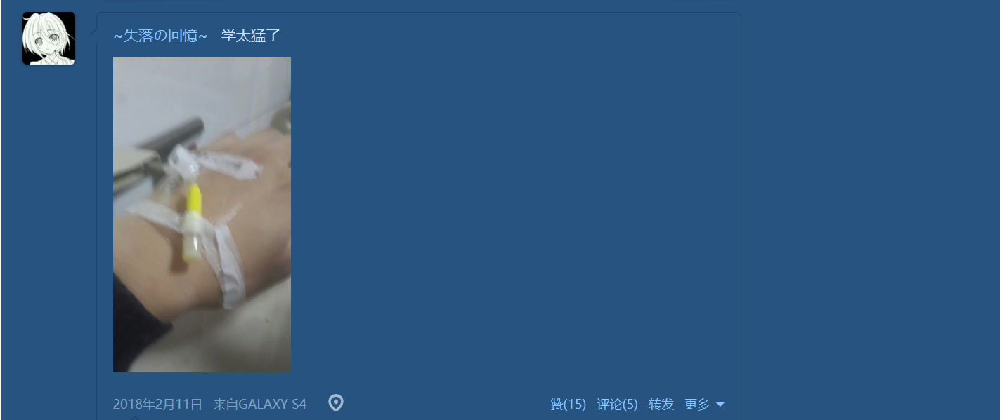
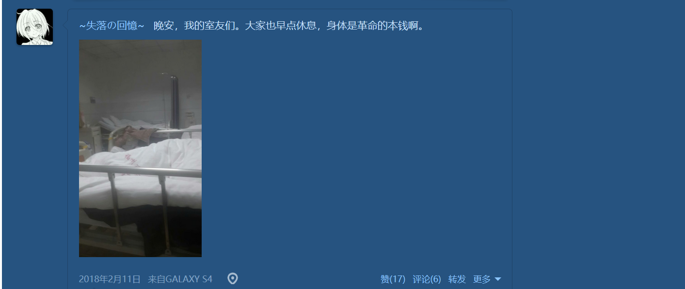
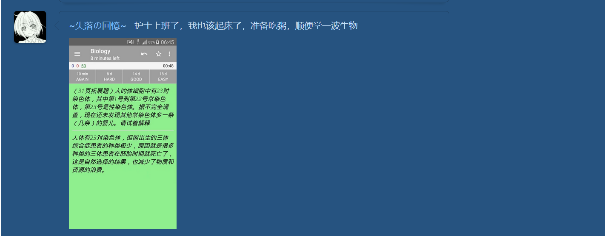
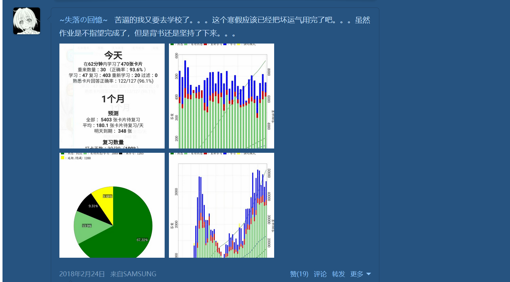
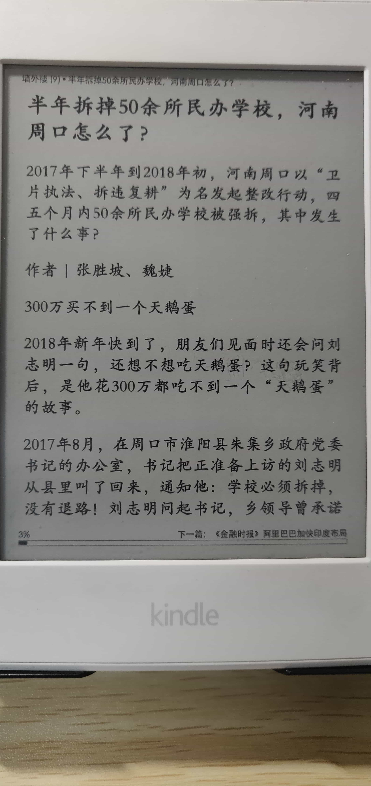
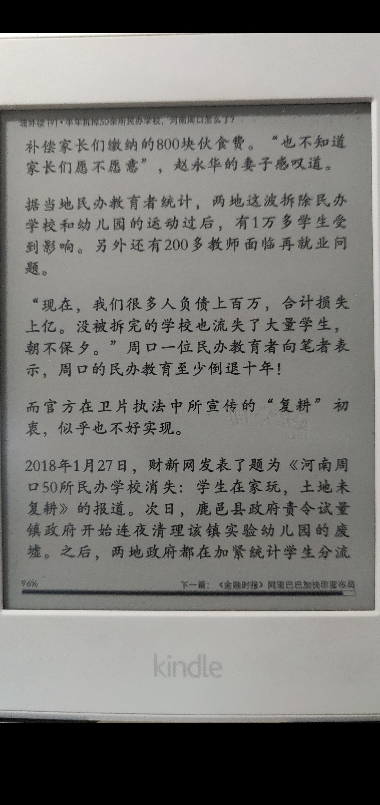
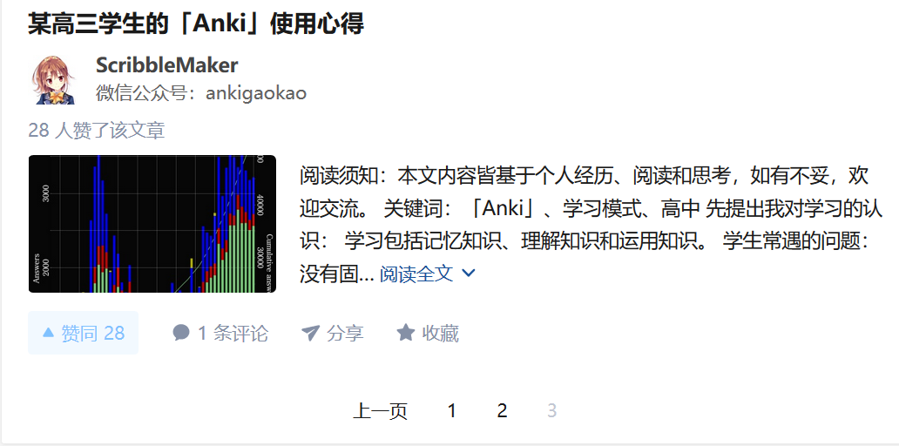
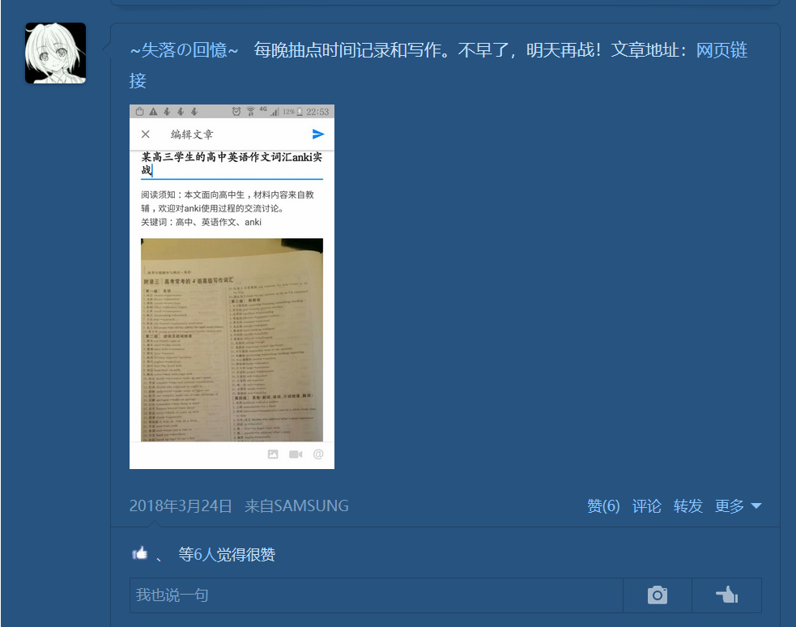
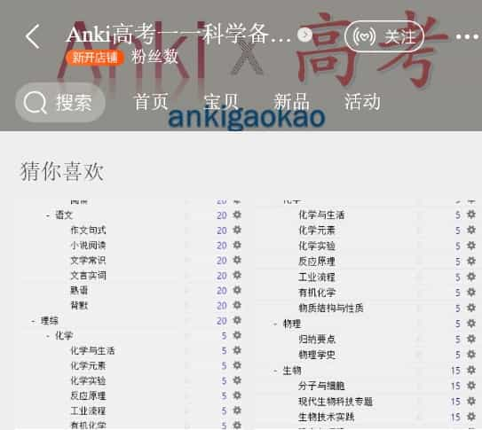

> 希望你们可以看到这里
[TOC=2,4]
我写书的工作已经完成了，但是你们的收获并不在于看完本书，而是是否开始行动。

可是，行动需要动力。你用 Anki 来备战高考的动力是什么？

如果你还没有答案，不妨看看我的动力——人生的意义。

## 创造意义之路

大家还记得我的高中目标吗？

*在高考中拿**尽可能多的分数**，并以**较少的时间、精力、意志和感情**做到这一点。*

其实，在高考前的最后一个寒假，我经历了一次肺炎，

:-: 

:-: 

死亡、孤独、无意义等概念围绕着我，我不知道学习的意义是什么，甚至对活着的意义产生了怀疑。

:-: 

:-: 

无聊的我在病床上偶然看到一篇文章

:-: 

:-: 

我突然觉悟，和这些没有学上（缺乏教育资源）的孩子相比，我目前的处境又算得上什么呢？

想着想着，眼眶不禁湿润起来。我觉得我该做一些事情，来帮助他们。

我似乎找到了意义。

但是，我又是何等的无力。我仅仅凭着学来的 Anki 学习法，在成绩上有所飞跃。但在高考的体系之外，我的能力一文不值。

于是，我的目标更新了，我不仅要让我自己
*在高考中拿**尽可能多的分数**，并以**较少的时间、精力、意志和感情**做到这一点。*
我还要让更多缺乏教育资源或在学习上迷茫的同学，一起达到这一点！这便是我为自己创造的**意义**！

于是，在**意义**的驱动下，我开始了第一本书和知乎专栏的写作。  

:-: 

:-: 

:-: 

然后，我便一边用 Anki 准备高考，一边写文章推广 Anki 。那时我学习的一大**动力**便是先让自己强大，证明 Anki 学习法的优越性，再去说服别人。我的所作所为都为了我的**意义**服务。

最后高考取得了不错的成绩，专栏也办的还行，并认识了不少有相近志向的人。

但是这远远不够，Anki 的使用还是太局限了，而且使用门槛过高（别忘了本书是为了降低试用Anki的门槛而写的），以及大多数家长和老师对使用手机学习表示怀疑，这使得 Anki 在高中的推广频频受阻。

为了实现我的**意义**，认识到这些问题的我，逐渐构筑出了自己未来的道路——学习计算机专业，写一个多功能的学习软件，兼学习复习刷题讨论等功能的学习平台。**建立一个在线学习平台，缩小人均教育资源差距，向低成本的教育平等出发！**

**这便是我的意义，而你呢？**

## 支持作者（也是支持你自己）

欢迎购买 Anki 高考牌组
>[success] [点击访问手机淘宝店](http://www.jiagou.cn/tb.asp?link=http://tb.cn/s2TMENw)

购买除试用牌组外的牌组即可进入 QQ 群，参加高中知识全覆盖的大型 Anki 制卡活动。拯救高中生，从我们开始！

:-: 

也愿大家掌握 Anki 学习法，不再迷茫、不再自我怀疑地学下去！

## 关于智商税

当然，不要这么着急地支持，还可以再考虑考虑，先想想我是不是收智商税的。

现在卖课程经常被说是收智商税。

我来讲讲怎么避免被收智商税。

很简单，打开闲鱼或者淘宝，搜索课程的名字，如果看到有50元以内的，而平台卖几百元的，很大程度上就是收智商税了。

那我是不是在收智商税？

首先，我不卖课程，唯一的课程就是本书，而本书是公开的，以后也不会封闭。

然后，Anki 这套学习法我现在还在大学中使用，我不会说一套做一套。

最后，无论你是否购买牌组，你都已经通过本书学会了「**如何使用 Anki**」，这才是最宝贵的财富。我的牌组只是给你提供一个有基础架构的平台，让你站得更高，看得更远。
再附一张我在 2018 年 5 月 18 日的 Anki 统计数据

:-: 

## 一些在学习上省钱、省时的方法

1. 少报补习班
2. 少报付费网课
3. 找网盘资源推荐盘多多[^盘多多]
4. 百度云下载提速用 speedpan[^speedpan]
5. 实在想报网课，可以先去闲鱼和淘宝搜一下
6. 刷题瞄准高考真题，而且要有详解
7. 教辅上有用的资料可以做成卡片复习
8. 学会搜索，别被百度的广告骗了
9. 离那些天天推荐课程的人远一点 
10. 已经买过相关课程没有进步，就不要再买了

[^盘多多]: http://www.panduoduo.net/
[^speedpan]: https://www.speedpan.com/
