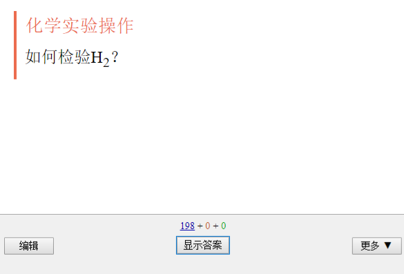
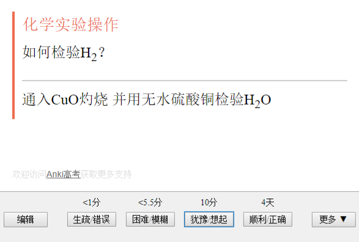

> 介绍一下 Anki

[TOC=2,4]

 Anki 是一个**辅助记忆软件**，它可以在相对合适的时间来告诉你复习什么比较好。

你可能会问：记忆还需要辅助？这意味着你可能并不认识**遗忘曲线**。

## 1.1.1 遗忘曲线

:-: 

:-: 

:-: 

[Piotr Wozniak](https://supermemo.guru/wiki/Piotr_Wozniak "Piotr Wozniak") 在他的记忆实验中总结出了该曲线，体现了中长期记忆的遗忘率。显然，随着时间流逝，我们遗忘的知识也越来越多。如果不进行复习，最终会忘记大部分曾记住的内容。 

那么，Anki 如何辅助我们记忆？在此前你有必要先了解一下**间隔反复**。

## 1.1.2 间隔重复

> 间隔重复可以用于改善学习的观点最初是由塞西尔·阿莱克·梅斯（Cecil Alec Mace）教授于 1932 年在学习心理学（Learning Psychology）一书中提出的：“也许最重要的发现是那些有关于学习时间分布的结果......**对知识的复习和回顾应该反复多次，并且逐渐增加时间间隔，比如一天，两天，四天，八天等等。**

通过间隔反复，我们掌握了对抗遗忘的「法宝」。

你可能会说：好吧好吧，这些道理我都懂，这和 Anki 有什么关系吗？

## 1.1.3 Anki 原理

Anki  基于**间隔重复**方法，按照材料的难易程度， 控制对应的重复频率。难以记住的材料经常出现，而简单材料出现频率较低，其材料难度由软件根据用户的辨认正确率确定。从而使用户达到目标水平，比如正确记住 **90**％的材料。

可能这样说有点抽象，下面几张图会帮助你理解上面的文字。

:-: 

「卡片」是 Anki 储存学习材料的最小载体。

「卡片」正面通常是引起回忆的提示，可以是单词、文言实词，也可以是数理化中的一个概念、定理的名字，或者是一个问题。

:-: 

「卡片」背面则可以是单词、文言实词的释义，也可以是数理化中概念和定理的内容或是问题的答案。

通过点击下面的按钮，Anki 就会安排下次遇到这张「卡片」的时间。

间隔重复的算法我将在
>[success]  [4.5 算法参数修改](../advanced-operation/parameter.md) 
> 
这一章节详细叙述。

