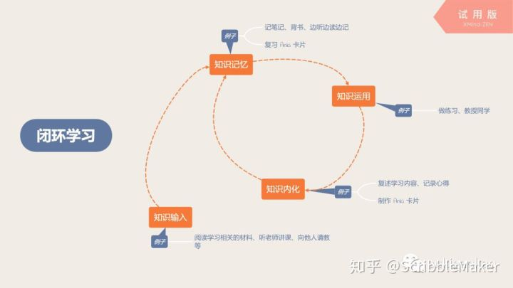

# 1.2 高考是什么？

高考是什么？

~~百度百科：~~

> ~~普通高等学校招生全国统一考试（The National College Entrance Examination），简称“高考”，是~~[~~中华人民共和国~~](https://baike.baidu.com/item/%E4%B8%AD%E5%8D%8E%E4%BA%BA%E6%B0%91%E5%85%B1%E5%92%8C%E5%9B%BD/106554)~~（不包括香港特别行政区、澳门特别行政区和~~[~~台湾省~~](https://baike.baidu.com/item/%E5%8F%B0%E6%B9%BE%E7%9C%81/761219)~~）合格的高中毕业生或具有同等学历的考生参加的选拔性考试。~~

上面这个是事实，无需废话。重要的是，作为一名学生，**你**是怎么看待高考和高中三年的？

私货预警！下文均为个人看法。当然，我会努力论证我的观点。

## 1.2.1 我对高中三年的看法

在这三年里，我们应当_在高考中拿**尽可能多的分数**，并以**较少的时间、精力、意志和感情**做到这一点。_

这样，我们就能空出足够多的课余时间，进行**自己的规划**，**了解社会**、**科技**等将要成为成年人的我们需要明白的，但**学校又不会教授的知识**。

以上是我高中的目标，之后会反复出现。

## 1.2.2 为什么我会这样看？

因为：

 高考，是一场选拔。所以，为了脱颖而出，你需要尽可能多的分数。

因为：

青春，不应该只有高考。高考之外还有更多的体验需要我们的时间、精力、意志和感情。所以我们不应该竭尽全力投入于高考之中。

因为：

坚持学习需要动力。而对于世界的认识，还有自己的目标，是最优质的动力来源。所以，我们当抽出课余时间来找到自己的目标，获得动力。

## 1.2.3 怎么办呢？

为了实现我们这三年的目标，我们必须要**高效学习。**

为此，我们当先弄清楚，什么是学习。

### 1.2.3.1 学习是什么？

 我将高中学习分为四个模块：知识输入、知识记忆、知识应用和知识的归纳反思。

**知识输入**，即阅读学习相关的材料、听老师讲课、向他人请教等。

**知识记忆**，即记笔记、背书、边听边读边记等。

**知识应用**，即做题，传授于他人等。

**知识的归纳反思**，即将知识内化，成为自己理解的东西，并且将输入的知识形成自己的知识体系。

 不难发现，其实我们高中学习就是重复着上述四个过程。

我们每天看教科书、听课、看网课、向同学请教问题等，都是知识的输入过程。

而把这些知识记录在我们的脑子里或者是笔记本上，都是知识的记忆过程。

每天必不可少的做题几乎是我们唯一的知识应用过程。

而归纳自己的错题、笔记，反思自己的短板以及对知识的误解和误区，就是知识的归纳反思过程。

这四个模块可以形成一个**学习闭环：**

  
知道了何为学习后，我们便可以开始针对学习的每一环进行规划和优化。

### 1.2.3.2 该如何学习？

针对知识输入环节，我们可以先看看课本章节后的问题，再去阅读正文；

针对知识记忆环节，我们可以复习记有这些知识的 Anki 卡片，或者自己背诵；

针对知识运用环节，我们可以多做习题。如何刷题？可以看这篇文章[5.3 刷题与错题](../the-way-to-study/prectise-make-perfect.md)

针对知识内化环节，我们可以将学到的概念、公式、定理、解释等内容制作成 Anki 卡片来加深我们的理解。也可以教授他人我们所学的知识，可以参见费曼学习法。  

