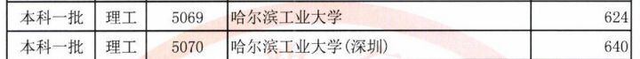
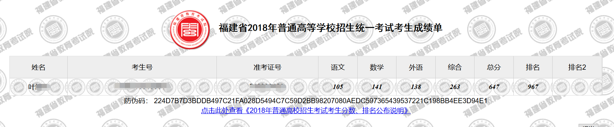

> :-: 你想知道如何高考逆袭吗？ 看我用 Anki 从本一线上涨 157 分！

2018 年高考已然落幕，但回首高三这一年化茧成蝶的蜕变，让我自己都感到不可思议，也让我深感幸运与感激。

英语从 92 分到高考 138 分，总分从本一线 490 分到高考 647 分（理科省排名 967，全省考生 20 万），在家人、同学惊叹的目光中高歌猛进。如今，武大、厦大、中山大学、南开这些曾经梦想的学府，现在却被我抛之脑后。

:-: 

:-: 

这一切，都是因为我遇到的一位补习老师的一句话：

:-: 「**学习方法，比你的努力和天赋更重要。**」

我**有天赋么**？曾经有，可以不怎么写作业还可以拿年段前二十名的成绩，但那是初中。

我**努力过吗**？在高中，身边的同学个个都是人才，我只能靠努力去追赶。各种补习班填满了我的假期，几乎每一位补习老师都激励我去奋发图强。可是我的水平并没有多大长进，英语和语文始终在及格线边缘徘徊。

就当高三要来临时，我又参加了一个新的补习班，而转机也随之而来。我开始了我的**学习方法**探索之旅。

我英语最差的原因就是**记不住单词和词组**，老师让我刷单选题，然后把错题中的单词或词组结合语境进行讲解。然后我再用笔记本以以下格式记录下来：

一开始我是这样记的：

:-: 

老师看我**记得很慢**，看了我的笔记本一眼，结果我被一通数落：「**记这么密干嘛**？我打包票你这样记完是**不会去看**的。」

这番话让我想通了很多：「我以前记的笔记都记得很挤，**看的难受**。而且看到信息量如此之大后就容易**心生退意**，**无法坚持**的复习完自己的笔记。而且这样记还需要我考虑每个词条的长度，生怕不够记还得调整间距，让版面变得很不整齐，这会让我轻微的强迫症发作。」

于是老师给我了他的笔记本，让我按照他的格式改，改完后效果如下：

:-: 

将笔记本横置，用随意的线条将版面大致均分为 4 列。松散地安置每条笔记的位置。这样一来，我可以肆意地**加快**我写笔记的**速度**，并且复习笔记时不会头皮发麻，很**轻松**地就能复习完一页笔记。而且这样也方便用纸挡住英文或中文的一列，测试自己是否能回忆出对应的意思。

改变记笔记的方法之后，果然**效率大增**。松散的排布和较大的字体，我可以在公交车上或食堂排队时拿出笔记本进行复习。

但是方法永远没有完美的。纸质笔记的缺点随着我的笔记增多开始凸显出来：**查找某个知识点花费的时间长，安排复习容易遗漏，做标记也需要一页一页找**。为了**提高效率**，我开始自己研究学习方法，因为此时的我已经明白，一个好的学习方法真的能**提高学习效率**，甚至改变我的**习惯**。

也正是这个时期，我认识了知乎。知道了白诗诗、Guenlan、核聚、超级高考生、战数高手等一批传授知识与方法的大 V，知道了康奈尔笔记法、观澜作文、圆锥曲线的各种定理等从未了解过的知识。

但是最重要的是，我发现了 Anki 。它的理念非常符合我之前的学习方法，并且和我看到的不少学习方法的思想不谋而合。

Anki 是一款美国的学习辅助软件，**开源软件**，**免费使用**；

它的基本原理可以描述为三个方面：

一、通过「卡片式学习法」，将知识点碎片化，问题和答案分离，逐条掌握知识；

二、通过分类与标签管理已有的知识点，使现有知识点条理清晰；

三、通过「艾宾浩斯遗忘曲线」算法，精确掌握每张卡片的复习时间，成倍提高复习效率。

也就是说，通过任意材料（书本、网课、课堂）+ Anki，将学习材料中不明白的、需要重点掌握的知识，录入 Anki 中，就可以实现「**高效学习**\+ 科学知识管理 +**精准复习**」的**学习闭环**，无需考虑**遗忘**，无需反复复习学习过的材料，完全由 Anki 的算法告诉你你复习任务，整个学习路线清晰明朗。

然而，学校对手机的监管是无比的严格。金属探测仪、信号屏蔽门，但是这些都无法阻止我对学习的渴望。为了使用 Anki，我偷偷将手机带进学校并且没在生管处登记。为了不被老师发现，我总在黎明时分起床，用 Anki 复习，从此养成了早起的习惯。使用 Anki 的 365 个日日夜夜最终令我高考逆袭，杀进福建省前**1000**名，取得理科总分**647**的好成绩。

现在就读于哈尔滨工业大学(深圳)的计算机专业

:-: 

以下是 Anki 的界面图以及我的使用情况，请大家感受其中蕴含的科学原理。

:-: 

:-: 

:-: 

:-: 

:-: 

我结合了很多学习理论和方法并运用到 Anki 中：

**举例一**：许多人看网络小说可以十分专注，但是一看教科书就走神。这是为什么呢？

Will Zhang 的答案：当我们处理信息的速度趋近于接收信息的速度时，我们容易长时间集中注意力。网络小说信息量是不及教科书的，更不用说我们看网络小说一目十行，中间全靠脑补，照样可以看懂剧情。但是教科书信息量密集，我们跟不上教科书的思维，可能因为不知道他说这些是在干嘛，也可能因为不知道他要干嘛，看了一会儿我们自然就很容易地丢失了注意力。

Anki 的解决办法：尽可能**减少一条笔记的信息量**。这样我们复习时每次只需要面对一小块知识点，我们的处理速度就能跟上接收速度。这样一来，我们的**专注度**就**提升**了，持续学习下去的**阻碍**也**减少**了。

**举例二**：看书时印象深刻，但是忘记的非常快，哪怕之后不断重新回看。

高太爷 的答案：自我检测效果要远远好于复读和背诵，更加有利于知识的掌握、理解。

Anki 的解决办法：用正反面卡片的形式复习，促使我们主动回忆知识，这便是自我检测。毕竟，知识**不用就会忘记**，让 Anki 来提醒你使用你的知识。

**举例三**：错题本做了，可是每次复习错题都很吃力，而且错题不断增加，甚至有种错过一次还错的感觉。

我 的答案：错题本如果只是收录错题，就无法调用知识间的联系来加深我们的理解。特别是每天的错题都来自不同的模块，一起复习时我们就要不断的提取关联性不大的知识，这反而会降低对单独模块的印象。

Anki 的解决方法：按照牌组来归纳错题，在错题的复习过程中寻找**相似的套路**，并随时在卡片上记录**自己的心得**。

**通过对学习方法的深度探索，我最终找到了「Anki」这一最优解，实现了高考的逆袭，也改变了一生的命运**。所以，作为今年刚毕业的学长，我希望告诉各位学弟学妹：

1\. 对于普通人来说，**学习方法 > 努力 > 天赋**；

2\. 开始探索自己学习方法的最好时机是 10 年前，其次就是**现在**；

3\. 需要依靠太多**意志**和**自控力**的方法，都不是好方法。

4\. 对 Anki 有兴趣的同学可以关注一下[**我的专栏**](https://zhuanlan.zhihu.com/ankigaokao)了解一下。