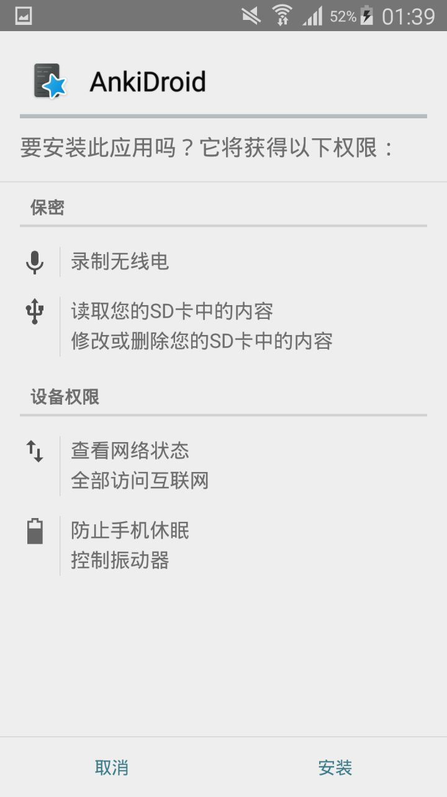
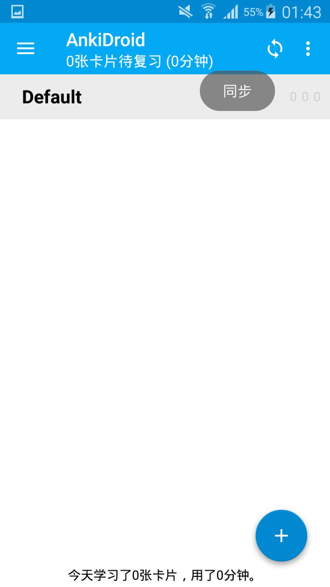
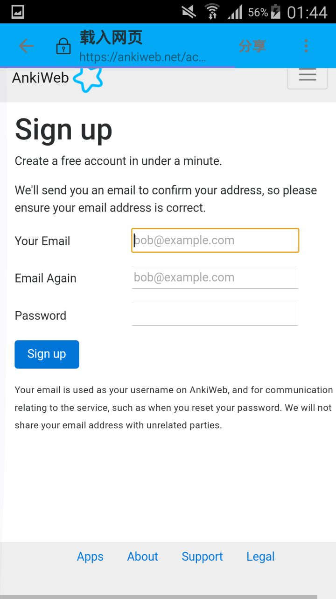
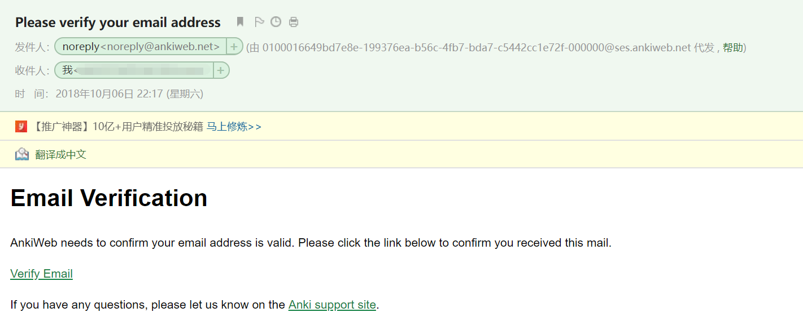

> 安卓手机就是 Android 系统哦~
> 2019/1/24 更新[视频教程](https://www.bilibili.com/video/av41518619)

[TOC=2,4]

## 2.2.1 下载软件

介于国内的安卓手机无法通过 Google Play 下载和安装 Anki

这里推荐通过我的百度网盘下载
>[warning] 点击下面的两个链接中的一个即可
> **注意**，这会导致转跳到本书之外的网站
> 百度网盘
> https://pan.baidu.com/s/16JFHGO9Yk1hlUD1d84iCGA

## 2.2.2 安装软件

下载下来的 .apk 在手机上打开，即可安装

:-: 

## 2.2.3 注册账号

:-:  打开 AnkiDroid

:-: 

:-: 点击同步

:-:  

:-: 点击登录

:-:  

:-: 点击注册

:-: 

:-: 注册账号（记得去注册邮箱点击验证邮件）

:-: 

:-: 点击 Verify Email

:-: 

:-: 返回登录

*****
准备工作结束，可以去学学基础使用啦！

>[success] [第3章 基础用法](../basic-usage/basic-usage.md)

