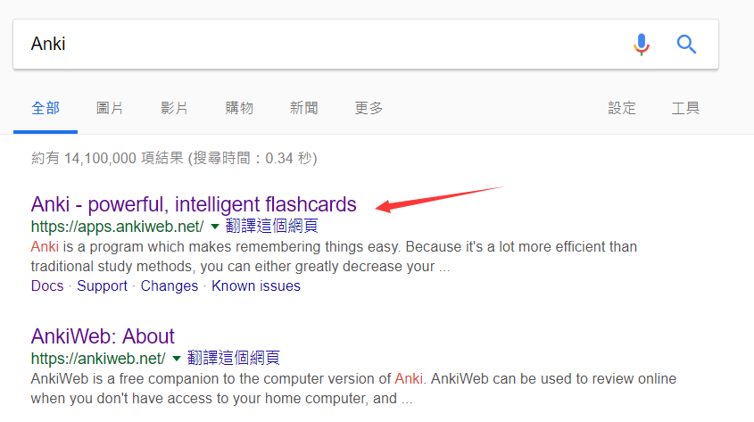
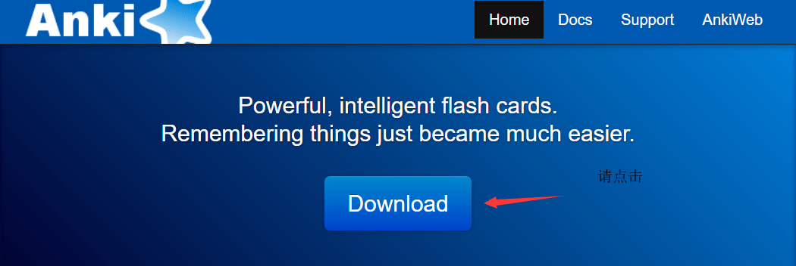

# 2.1 Windows/Mac
> 因为桌面端的差不多，就一起写了
## 2.1.1 下载安装

哈喽，我是王二哈。由于我只有一个 Windows 10 的电脑，所以下面全部是在 Windows 10 上的操作结果。

### 2.1.1.1 搜索 Anki

### 2.1.1.2 下载  Anki

或者，通过[百度云](https://pan.baidu.com/s/16JFHGO9Yk1hlUD1d84iCGA)下载，我会时不时的更新一下。

## 2.1.2 注册账号

