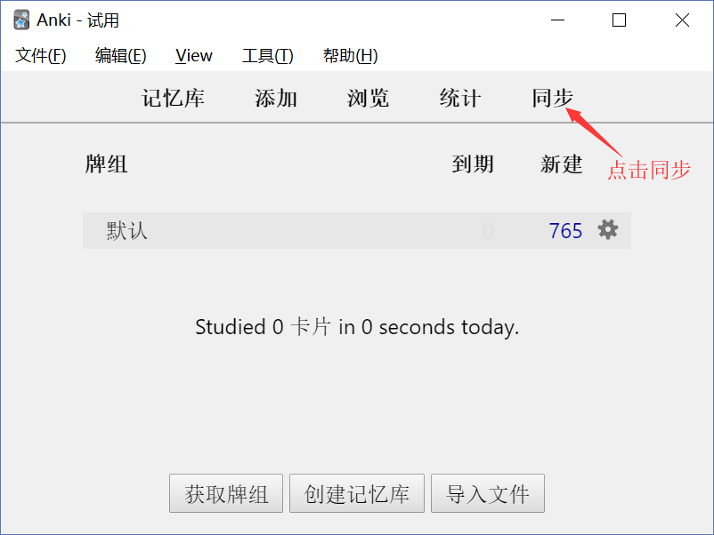
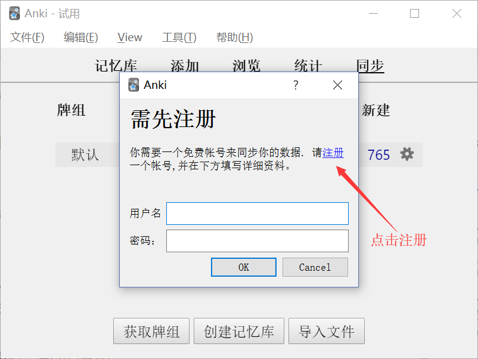
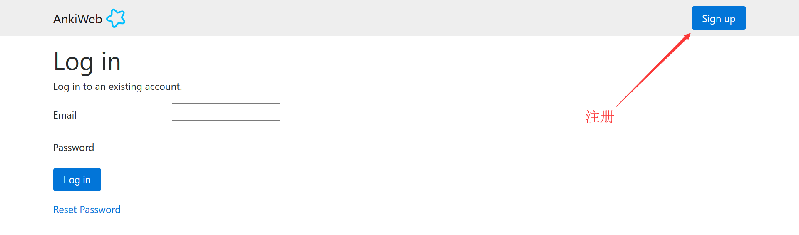

> 因为桌面端的差不多，就一起写了

[TOC=2,4]

## 2.1.1 下载安装

### 2.1.1.1 搜索 Anki

:-: 

### 2.1.1.2 下载  Anki

:-: 

或者，通过我的百度网盘分享下载
>[warning]    **注意**，这会导致转跳到本书之外的网站
> 百度网盘
> https://pan.baidu.com/s/16JFHGO9Yk1hlUD1d84iCGA

我会时不时的更新一下。

## 2.1.2 注册账号

:-: 

:-: 

:-: 

:-: 

注册完记得去邮箱点击验证邮件，没收到可能是在垃圾邮件里，还请注意哦~

:-: 