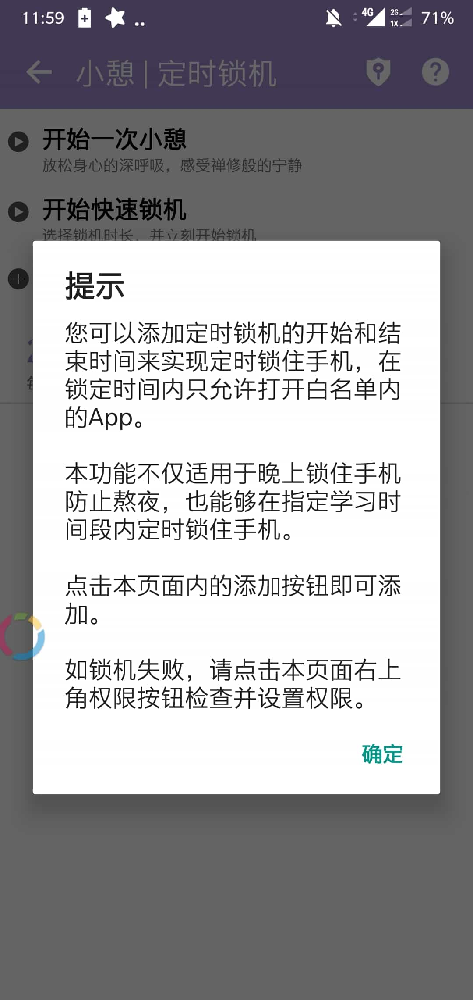

# 5.5 自律与规划

其实标题中的两个东西我都不信我能独自做到。

但是我这有个神器可以协助我们做到“自律”和“规划”。

## 番茄ToDo

  
安卓应用市场一般都可以搜索到。有了它，再也不用害怕管不住自己的手了！

而且可以给各种番茄钟命名，提醒自己还未完成的事情。

至于时间规划，我只想说：与其安排每件事的进行时间，不如**马上开始**。

所以，番茄钟只需要发挥**清单**的作用即可。

## 但是

真的这么简单吗？？？为什么我们会把空闲的时间拿去娱乐而不是学习？

其实，是因为我们缺乏一个有吸引力的目标。

或者，我们的目标不够走心，一下就忘了。

虽然有个目标很重要，但是这一点上我提供不了太多帮助。

还记得我之前提过的梦想和目标吗？

_在高考中拿**尽可能多的分数**，并以**较少的时间、精力、意志和感情**做到这一点。_希望所有的高中生不要被高考夺去青春，夺去那美好的时光。

这是我的目标，如果你也希望，不妨把这句话写在最显眼的位置。如果你不认同，也可以写自己的目标。

