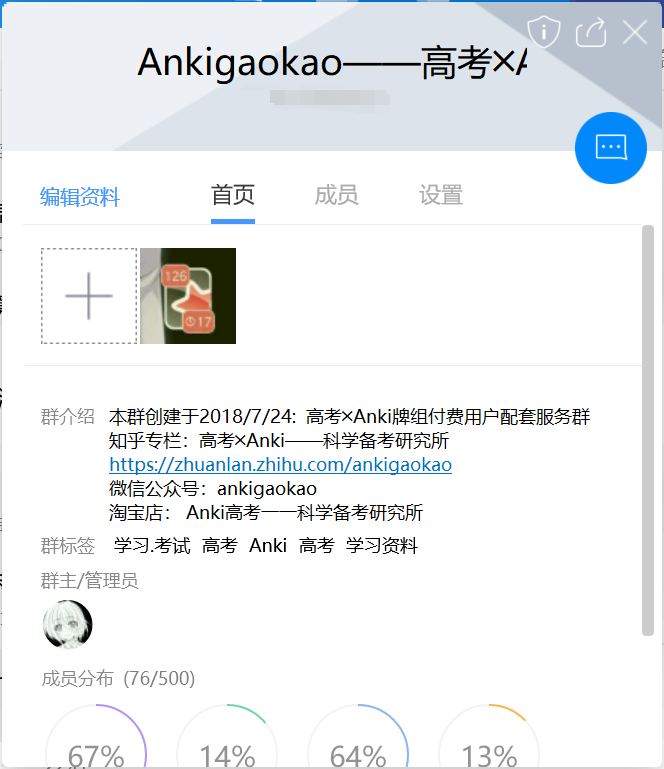
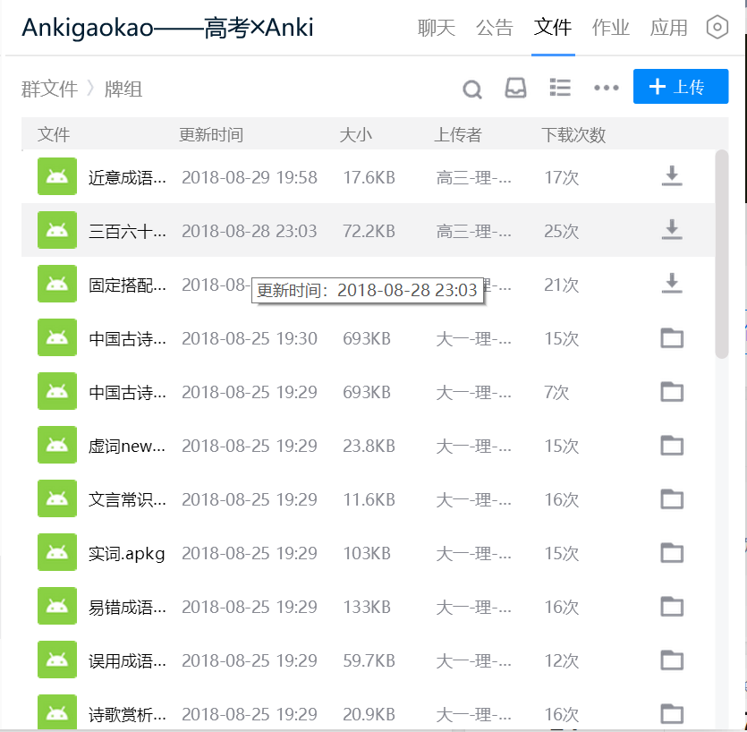
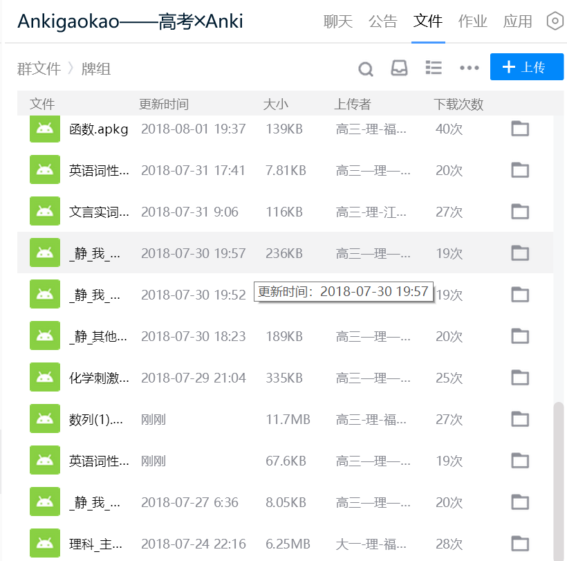
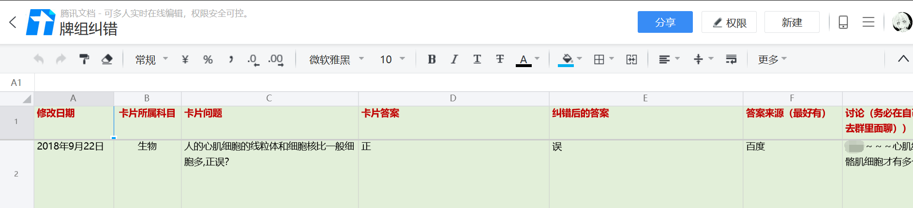
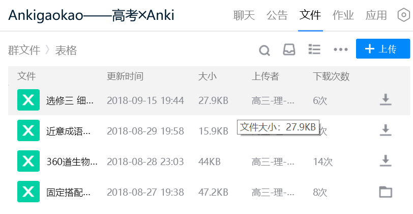

# 5.2 合作学习
> 如何利用团队提高学习效率

## 5.2.1 背景

面临越来越多的知识、题目，一个人独自在学海中奋战愈发辛苦，团队合作、共同学习的需求愈发尖锐，因此我就在此为大家介绍「Anki」在团队学习中的作用。

## 5.2.2 适用场景

录入大量材料、考向明确、存在标准答案

## 5.2.3 实现方案

根据高考考查的范围，细化知识组块，明确学习材料，分工协助制作卡片，相互分享牌组。在总复习阶段，大家可以一起归纳易错点以及各科考试小技巧，不放走任何细节。

## 5.2.4 讲讲我的故事

### 我与我的七人小组

每一次老师发布复习材料，我们的组员都会讨论材料是否可以做成「Anki」卡片、用什么样的卡片模板以及每个人的负责范围。

除此之外，我们还会定期分享最近总结的易错点，并且互相检查各自的表述、归纳是否准确。

我们还会有时还会在知乎上找一些关于高考的优质内容。比如语文熟语、文化常识、生物知识、答题模板等等。充分发挥了每个人的收集能力。

注意：成员之间必须相互信任，不要贪图小利，也不要看不上别人的学习能力，小组成员最好都是朋友，并敢于尝试新的学习方法。遇到分歧，一定要一起讨论，听听大家是怎么看问题的。

优势：一个好问题胜过千个答案。团队之中每个人看待知识的角度不尽相同，不一样的角度有助于我们立体地理解知识，加深印象，覆盖更多角落。

~~缺点：每个人的语言表达各有差异，可能造成歧义，并且组员制作的卡片可能互有重叠，造成过度重复。~~

## 5.2.5 更新

由于认识了更多的 Ankier ，了解了更多的合作工具，上述缺点已经被解决了！

我的团队

先看看我组建的新团队输出的牌组

  
30个牌组，已经比我高三一年做的卡片还多了

为了方便我们一起制作牌组，我们使用了团队合作的利器：在线表格

合理规划，公开制作信息，避免重复制作，还能与他人合作，加快制卡进度。

牌组透明，随时可纠错。

